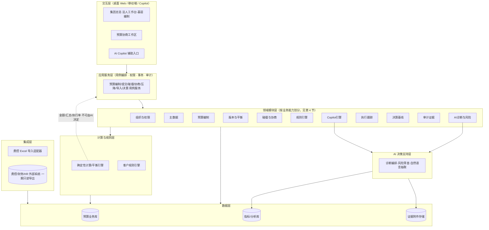
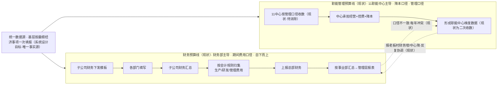
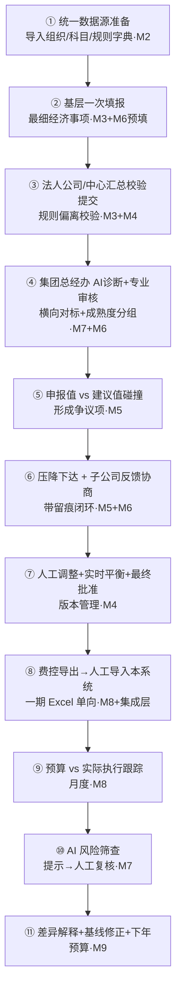
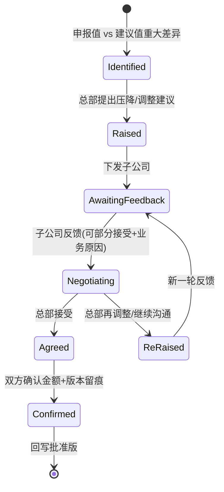
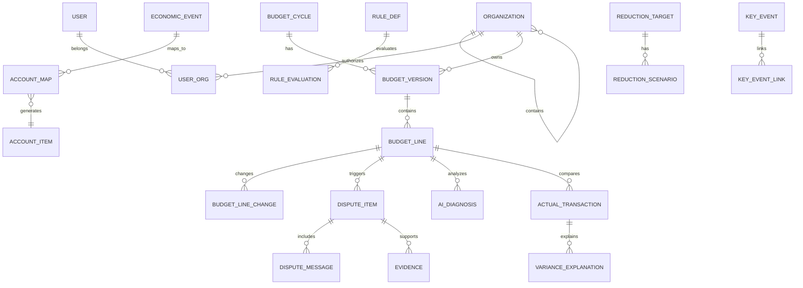

# 三安光电 AI 费用预决算管理系统 · 产品设计稿 V1

> 文档性质：阶段二「设计」产物（产品架构 + 模块设计 + 业务流程）  
> 权威来源：`docs/product/三安光电AI费用预决算管理系统需求调研稿V2.md`（2026-08-21 会议纪要确认版）  
> 技术骨架参考：`docs/architecture/软件设计架构分析V1.md`（基于 V1 需求的技术分析，本文吸收其已验证结论）  
> 阅读对象：产品负责人定稿拍板 → 开发角色只读本文进入阶段三  
> 文档状态：**草案待拍板**。文中「★ 推荐」为设计角色推荐方案，需定稿拍板后生效；未拍板不得进入开发。

---

## 0. 本文档与需求稿 V2 的关系

| 文档 | 角色 | 内容 |
|---|---|---|
| 需求调研稿 V2 | 阶段一对齐结论 | 客户现状、痛点、一期三目标、不做清单、待确认项 |
| **本产品设计稿 V1** | **阶段二设计产物** | 把 V2 的确认范围落为**可实现的架构 / 模块 / 流程** |
| `docs/plans/` 任务拆分 | 阶段二延伸 | 一期建设的可执行阶段与任务清单 |
| 开发实现 | 阶段三 | 只读本文 + plans，不重新讨论需求 |

> 纪律：本稿只处理 V2 **已确认**的范围。V2 §8 的 21 项待确认内容，凡影响设计的，统一归集到本文第 8 节「待拍板清单」，不在此展开假设。

---


> 本文档版本：V1（2026-08-21），基于需求调研稿 V2（会议纪要确认版）首次产出产品设计稿。
## 1. 一期范围与设计约束

### 1.1 一期三目标

| 目标 | 核心内容 | 对应模块（见第 4 节） |
|---|---|---|
| **目标一 · 预算编制及统计自动化** | 统一窗口、统一科目、一次填报、自动汇总、多维度报表、调整确认、查询提效 | M2 主数据 / M3 编制 / M4 版本平衡 / M5 协商 / M6 规则引擎 |
| **目标二 · 简单预算执行跟踪** | 费控导出实际 → 人工 Excel 导入；预算 vs 实际、执行率、超标预警；一期事后分析为主，不强制事前锁预算 | M8 执行跟踪 |
| **目标三 · AI 费用风险识别** | 疑似错科目 / 费用转移 / 异常增长 / 报销异常 / 结构异常 / 高风险单位；AI 仅提示，人工复核 | M7 AI 诊断与风险筛查 |

### 1.2 一期明确不做

全面改造费控系统 / 替代报销系统 / 强制事前锁预算 / 复杂实时费控 / AI 自动审批 / AI 直接判定违规 / AI 直接决定压降金额 / 一次性建设完整集团财务管理平台。

### 1.3 设计硬约束

1. **单数据源双派生视角**：系统以统一收集的预算为唯一事实源，同时派生「财务聚合视角（期间费用口径，财务部主导）」与「管理指标视角（降本目标口径，11 职能中心主导）」；两视角均基于同一份数据，管理线下达的指标/压降为对同数据的调整，不另存第二份，并支持双口径对账。
2. **统一数据源**：以 ~390 项「经济事项」为最细事实源，系统按「经济事项 → 会计科目」映射自动生成财务/各中心/事业部/管理层多口径视图；基层只填一次。
3. **费控单向导入**：一期仅「费控系统导出 Excel → 本系统人工导入」，不改造、不接 API、不做实时。
4. **AI 提示非判定**：AI 只把高风险对象「拎出来」供人工复核，不替代管理者判断；结论须可追溯到数据/规则/证据。
5. **协商留痕闭环**：总部建议 ↔ 子公司反馈 ↔ 调整原因 ↔ 最终确认金额 ↔ 版本，全程可追溯。
6. **数据模型基线**：`公司 × 事业部/生产单元 × 一级部门 × 预算科目（含会计科目映射） × 时间（年+月度 1~12）× 预算版本`，且组织层级可配置（非固定三级）。
7. **错位映射**：费用归属（法人/劳动关系）≠ 预算归属（总部/管理口径），系统须同时记录两归属属性并可映射（V2 §2.0 第三重错位）。

---

## 2. 总体产品架构

### 2.1 分层架构



### 2.2 各层职责边界

| 层 | 负责 | 不负责 |
|---|---|---|
| 交互层 | 展示、收集操作、调用 API | 不持有集团预算权威状态、不直接决定最终金额/审批/权限 |
| 应用服务层 | 用例编排、权限、事务、审计事件、计算触发 | 不把业务规则散落页面 |
| 领域模块层 | 按业务能力（11 模块）封装逻辑与实体 | 不直接拼 SQL、不绕过计算层算金额 |
| 计算与规则层 | 确定性汇总/平衡、客户规则预填与校验 | 不做自然语言解释、不做最终决策 |
| 数据层 | 业务库 + 指标库 + 附件 | 不在前端放生产数据/密钥 |
| 集成层 | 费控 Excel 单向导入、未来 API 适配 | 一期不写回费控、不接实时 |
| AI 层 | 特征计算后的解释、抽取、候选方案、风险初筛 | 不输出最终金额结论、不替代审批 |

### 2.3 总原则

> **确定性引擎决定「怎么算」，AI 建议「为什么 / 可选方案」，管理者决定「是否采用」。**

金额、比例、执行率、压降目标必须由确定性计算服务产出；模型只负责解释、归纳、分类与候选建议，且所有输出须可回溯依据。

---

## 3. 关键架构决策

> 以下 6 项为非平凡设计决策。每项列出 ≥2 备选、统一维度权衡、给出推荐与理由。**定稿拍板前，开发不得据此定型。**

### D1 · 系统架构形态

| 备选 | 优点 | 风险 | 结论 |
|---|---|---|---|
| A. 模块化单体 | 预算口径未稳、版本/争议/压降需统一事务、汇总一致性易保证；一期最快落地 | 规模化后需再拆 | ★ 推荐 |
| B. 微服务 | 长期可独立伸缩、团队并行 | 分布式事务/一致性复杂，一期过度设计；客户数据模型未稳 | 暂不取 |

**推荐 A 理由**：V2 确认的核心风险不是服务规模，而是「口径未稳 + 需统一事务 + 五维汇总必须一致」。先模块化单体，等业务/数据量明确后再拆集成、AI、报表为独立服务（架构 V1 §1.2 同结论）。

### D2 · 前端与现有 Demo 关系

| 备选 | 优点 | 风险 | 结论 |
|---|---|---|---|
| A. 保留 Demo 作验证前端 + 新建后端 | Demo 已验证交互方向；后端独立演进、职责清晰 | 双端短期并存需管理 | ★ 推荐 |
| B. 直接重写 Demo 为正式前端 | 单一代码库 | 过早投入前端工程，后端未定前易返工 | 暂不取 |

**推荐 A 理由**：架构 V1 §9 已确认 `website/` 定位为「客户验证前端」，不应立即重写。正式开发前把 `BM` 全局对象逐步拆为「页面 → 调用领域 API」。Demo v0.6 已覆盖组织树/规则引擎/对标/碰撞，可作为 API 合同与样例数据的前端试验场。

**Sponsor 补充（2026-08-21）**：现有 Demo 的**大框架与页面复用**，不重写；按需要升级设计风格、补充新增功能页面。前端实现约束见 §3.0。

### D3 · AI 实现路线

| 备选 | 优点 | 风险 | 结论 |
|---|---|---|---|
| A. 纯规则引擎 | 可解释、可审计、零模型依赖 | 不能做自然语解释/抽取，价值天花板低 | 作基线，不单独取 |
| B. LLM Agent 直接决策 | 交互强 | 幻觉、不可审计、违反「提示非判定」红线 | 禁止 |
| C. 混合：确定性规则引擎为基线 + LLM 作「抽取/解释/候选方案」层 | 兼得可审计与智能；贴合 V2「AI 提示非判定」 | 需建指标层与证据链；模型调用须脱敏与最小化 | ★ 推荐 |

**推荐 C 理由**：V2 §6 明确 AI 适合「归纳/解释/初筛/结构化」，必须保留「最终认定/协商/批准」给人工。架构 V1 §13 分层（A/B/C 级能力）同结论：先规则与指标，再 LLM 解释。

### D4 · 费控系统集成方式

| 备选 | 优点 | 风险 | 结论 |
|---|---|---|---|
| A. API 实时接口 | 时效高 | 客户明确短期不改造费控、不接 API（V2 §3.4.6/§12） | 禁止（一期） |
| B. 人工 Excel 单向导入 | 符合客户确认路径；绕开财务地盘；一期零改造 | 频率低、需人工操作 | ★ 推荐（一期） |

**推荐 B 理由**：V2 §3.4.6 已权威确认「费控系统短期不改造、仅单向导出；一期人工 Excel 导入、暂不强制 API」。系统设计须把导入做成「模板 + 映射 + 对账 + 重复检测」，为未来 API 留适配位。

### D5 · 部署形态

| 备选 | 优点 | 风险 | 结论 |
|---|---|---|---|
| A. 本地 / 内网优先（一期） | 贴合当前演示与数据敏感现状；快 | 多端协同与账号体系待定 | 暂不选 |
| B. 公有云部署 | 易协同、多端访问、运维轻 | 敏感财务/个人数据须合规处置（加密、最小化、区域） | ★ 推荐（已拍板，按公有云方式部署） |

**推荐 B 理由（Sponsor 拍板）**：Sponsor 于 2026-08-21 明确选择公有云方式部署。设计须在该风险上落实合规底线——敏感财务/个人数据加密存储与传输、模型调用最小化与脱敏、数据区域与保留策略按云服务与监管要求配置；账号体系/SSO 仍属 §8 待确认项，不阻塞一期。

### D6 · 数据模型基线

V2 §3.1 已确认落地模型：`公司 × 事业部/生产单元 × 一级部门 × 预算科目（含会计科目映射） × 时间（年+月度） × 预算版本`，组织层级可配置。本稿第 6 节据此展开，**不作为待拍板项**（属 V2 已确认）。

### 3.0 前端实现约束与智能交互（Sponsor 确认）

基于 Sponsor 2026-08-21 指令，前端实现遵循：

1. **框架与页面复用**：复用现有 Demo（v0.6）的整体框架与已验证页面（组织树、规则引擎、对标、碰撞），不重写大框架；新功能在既有框架上扩展。
2. **设计风格升级**：在复用框架基础上提升视觉层级与差异化（角色工作台 Tab / 按钮 / 菜单差异化），保持简体中文 UI。
3. **新增页面补充**：一期三目标所需、Demo 未覆盖的页面（编制 / 导入 / 协商 / 审批 / AI 风险等）按既有框架补充。
4. **即时反馈交互（智能调参）**：预算出现冲突、调预算时，采用「滑块调参 + 另一侧即时出结果」的可视化界面——调整参数（金额 / 比率 / 压降幅度）实时刷新金额、比率、对标、可压降空间等结果，无需提交再查看。该模式作为 M5 碰撞协商模块核心交互，并可复用于其他参数调整场景。
5. **汇报机制**：每个模块的页面设计完成后，须向 Sponsor 报告（见 `governance/TEAM.md` 协作流程）。

> **D1–D5 已全部拍板（D1–D4 按推荐、D5 按公有云部署），本文定稿，可进入 `docs/plans/` 任务开发。前端实现约束见 §3.0。**

---

## 4. 模块设计

> 每个模块给出：职责边界 / 核心实体 / 关键接口（示例）/ 上下游 / 一期优先级（P0=目标一基础，P1=目标二，P2=目标三）。

### M1 · 组织与权限 `P0`
- **职责**：集团、法人公司、事业部、生产单元、一级部门、责任人的可配置层级树；角色与数据范围授权；敏感数据密级与可见范围。
- **核心实体**：`Organization`（自引用树）、`User`、`UserOrg`（授权）、`Role`、`DataScope`、`SensitivityLevel`。
- **关键接口**：`GET /api/organizations/tree`、`POST /api/organizations`、`GET /api/users/{id}/scope`。
- **上下游**：被所有模块依赖（数据权限底座）。须支持「费用归属 vs 预算归属」双属性记录（V2 §2.0 错位）。
- **注意**：V2 §8 待确认项 15/17/20（11 职能中心全清单、事业部↔法人归属、敏感数据密级）须先闭环才能定稿权限矩阵。

### M2 · 主数据 `P0`
- **职责**：三类字典的统一管理，作为单一事实源，从客户 Excel 导入而非手工重建。
  - **组织字典**：公司代码表（43 个代码，含独立法人子公司约十几家）、事业部/生产单元表（~40）、一级部门表（42）、11 职能中心表。
  - **科目字典**：经济事项（~390 项）↔ 会计科目编码 ↔ 二级/三级分类 ↔ 事项说明 ↔ 管理归口单位；含财务口径（~220 项模板）与管理口径映射。
  - **规则字典**：科目级编制/压降规则（下降5%、人均标准、营收比、食堂/宿舍/绿化专项、按实际预算类）+ 压降管理属性（业务关联度/刚性/新老业务/可压降程度/历史执行）。
- **核心实体**：`OrgDict`、`AccountItem`、`EconomicEvent`、`EventAccountMap`、`RuleDef`、`ReductionAttr`。
- **关键接口**：`POST /api/master-data/import`（Excel）、`GET /api/accounts/map`、`GET /api/rules`。
- **上下游**：被 M3/M4/M6/M7 消费；~390 项为统一数据源根。

### M3 · 预算编制 `P0`
- **职责**：基层按最细经济事项一次填报（唯一事实源）；**预算控制的方法**（历史参考/同比/固定/数量×单价/人均标准/业务量/管理标准/关键事件/人工）由上面（管理层/集团/中心负责人）统一定义并挂到各经济事项，**基层不自选方法**，只据实申报；系统按上级定义的方法生成控制基线并比对偏离；月度分解 1~12；偏离须记录原因。
- **核心实体**：`BudgetCycle`、`BudgetTask`、`BudgetLine`（五维+月度+版本）、`BasisRef`。
- **关键接口**：`POST /api/budget-cycles/{id}/tasks`、`PUT /api/budget-lines/{id}`、`POST /api/budget-lines/{id}/submit`。
- **上下游**：产出「申报版」→ M4；调用 M6 规则预填；调用 M2 科目映射自动生成多口径视图。

### M4 · 预算版本与平衡引擎 `P0`
- **职责**：版本头 + 明细 + 变更记录结构；五维任一层级汇总必须一致（组织汇总=项目汇总=集团总额）；变更实时重算影响；不可变批准版快照。
- **核心实体**：`BudgetVersion`（申报版/集团建议版/调整版/批准版）、`VersionDetail`、`BalanceCheck`、`ApprovalSnapshot`。
- **关键接口**：`POST /api/budget-versions`（生成建议版）、`POST /api/budget-versions/{id}/approve`、`GET /api/balance/check`。
- **上下游**：被 M5 碰撞、M7 诊断、M8 执行、M9 决算共同依赖；汇总计算强制走确定性引擎（D3 原则）。

### M5 · 预算碰撞与协商闭环 `P0`
- **职责**：公司申报值 vs 集团建议值对比（差异额/比例/历史执行/同比/业务依据/异常度/可压降空间/同类公司横向对标）；重大差异生成「预算争议项」；协商状态机（总部建议→子公司反馈→接受/再调整/继续沟通→确认）。
- **核心实体**：`DisputeItem`、`DisputeMessage`、`Evidence`、`NegotiationState`。
- **关键接口**：`POST /api/disputes`、`POST /api/disputes/{id}/messages`、`POST /api/disputes/{id}/resolve`。
- **上下游**：输入来自 M3/M4；规则基线来自 M6；对标来自 M7 指标；结果回写 M4 版本。
- **智能交互（Sponsor 确认）**：冲突调预算采用即时反馈界面——滑块调整参数（申报额/压降幅度/比率），另一侧实时刷新差异额、比例、可压降空间、同类对标等结果，边调边看、无需提交后再查（交互模式见 §3.0.4）。

### M6 · 客户规则引擎 `P0`
- **职责**：把 V2 §3.3.3 规则字典固化为可计算规则；编制预填基线 + 偏离校验；作为 AI 诊断「管理标准」依据；作为压降硬约束/软建议；规则可配置、版本化、可追溯。
- **核心实体**：`RuleDef`（适用科目/表达式/参数/生效年度/偏离需说明开关）、`RuleEvaluation`、`RuleVersion`。
- **关键接口**：`POST /api/rules`、`POST /api/rules/evaluate`、`GET /api/rules/{id}/history`。
- **上下游**：被 M3（预填）、M5（建议值起点）、M7（诊断依据）、M9（基线）调用。一期亮点。

### M7 · AI 诊断与风险筛查 `P2`
- **职责**：基于指标层做异常初筛 + LLM 解释/抽取/候选方案。诊断输出结构化对象（合理区间/异常/原因/建议金额/依据/风险/缺失数据/置信度）。风险筛查识别：疑似错科目、费用转移、异常金额/频率、结构异常、单位异常差异、高风险单位/费用。定位「提示非判定」。
- **核心实体**：`AiDiagnosis`、`AiRiskFlag`、`AiEvidence`、`Indicator`。
- **关键接口**：`POST /api/diagnostics/budget-lines/{id}/run`、`POST /api/risk-screening/run`、`GET /api/diagnostics/{id}`。
- **上下游**：依赖 M4 数据、M6 规则、DWH 指标；输出回 M5（争议）、M8（预警）、人工复核。
- **边界**：金额与比率由确定性计算给，模型只解释与候选（D3）。

### M8 · 执行跟踪 `P1`
- **职责**：费控系统导出 Excel → 人工导入；按五维+月度归集；预算 vs 实际对比；执行率/超标单位/超标科目/异常增长预警；事后监督带动事前约束。
- **核心实体**：`ActualImport`、`ActualTransaction`、`Variance`、`Alert`。
- **关键接口**：`POST /api/actual/import`（Excel）、`GET /api/execution/dashboard`、`GET /api/alerts`。
- **上下游**：输入来自集成层 IMPORT；对比用 M4 预算；预警联动 M7。一期 Excel，API 留适配位。

### M9 · 决算与基线修正 `P1/P2`
- **职责**：年度导入实际 → 差异分类（正常/异常执行/关键事件/延续下年/可作基线/不作基线）→ 基线修正建议 → 下年预算。关键事件须参与「是否剔除/延续/纳入基线」判断。
- **核心实体**：`Settlement`、`VarianceExplanation`、`BaselineReview`、`KeyEvent`。
- **关键接口**：`POST /api/settlements/{id}/baseline-review`、`POST /api/key-events`。
- **上下游**：依赖 M8 实际数据、M2 规则、M4 版本。

### M10 · 审计与证据链 `P0`
- **职责**：所有金额/版本/AI 结论/压降方案/审批的操作人、时间、旧值、新值、原因、证据、模型版本可追溯。
- **核心实体**：`AuditEvent`、`Evidence`、`AiTrace`。
- **关键接口**：`GET /api/audit/trail`、`POST /api/evidence`。
- **上下游**：被所有写操作埋点。

### M11 · Copilot 交互辅助 `P0/P2`
- **职责**：落实本稿 §5.7「双层驱动、统一落库」（技术实现视角见架构 V1 §12）。
  - **集团约束层**：会议纪要/管理目标/正式通知 → 结构化约束 → 集团级方案 → 下发。
  - **角色 Copilot 层**：个人用自然语言补充实际要求/业务依据 → 生成可编辑草稿与解释 → 回集团计算/平衡/协商。
  - 两层共用同一套版本/约束/证据/计算模型；自然语言约束先成「待确认约束」，不直成硬约束。
- **核心实体**：`Constraint`（全局/局部/待确认）、`CopilotSession`、`NlIntent`。
- **关键接口**：`POST /api/copilot/intent`、`POST /api/constraints/confirm`。
- **上下游**：调用 M3/M4/M6/M7；约束对象被 M5/M7 消费。

---

## 5. 业务流程

### 5.1 现状（两线各自收数）与系统设计目标（单一数据源 + 双派生视角）

> 以下 FIN/MGT 为**客户现状**：两条线各自手工收数、口径不一致导致每年冲突。**系统设计目标**是将其收敛为「单一数据源 + 双派生视角」——基层只填一次，系统派生财务聚合视角与管理指标视角，管理线不二次收集（详见 §5.7）。



系统价值点：用统一数据源 + 经济事项映射，把两线「事后吵架」转为「同一份数据、双派生视角、可映射、可对比、可定位差异」。

### 5.2 系统端到端流程



> ①②③④⑤⑥⑦ 属目标一（基础）；⑧⑨ 属目标二；⑩ 属目标三；⑪ 为闭环延伸。

### 5.3 预算协商闭环状态机



每轮保存：总部建议金额、子公司反馈金额、调整原因、最终确认金额、调整过程及版本、参与人。

### 5.4 压降下达—反馈闭环

```text
自下而上申报（基层→子公司→总部→老板）
        ↓
老板提压降目标（自上而下触发：总费用降 X% / 某类降 Y / 专项压降）
        ↓
总部按比例下达 + 结合业务情况协商
        ↓
压降须结合管理属性（业务关联度/刚性/新老业务/可压降程度），不一刀切（M6）
        ↓
子公司反馈（可部分接受，附业务原因）→ 协商闭环（见 5.3）
```

### 5.5 费控导入—执行跟踪流程

```text
费控系统导出 Excel（公司/事业部/生产单元/部门/单据/金额/费用说明/个人额度标准）
        ↓
本系统人工导入（模板+映射+重复检测）
        ↓
按五维+月度归集，与预算口径对齐
        ↓
预算 vs 实际：执行率/超标单位/超标科目/异常增长
        ↓
每月通报/分析/追踪（事后监督带动事前约束）
```

### 5.6 AI 风险筛查流程

```text
预算 + 实际数据
        ↓
规则初筛（错科目/费用转移/异常金额频率/结构异常/单位差异）
        ↓
LLM 解释与候选（从海量数据"拎出"高风险对象）
        ↓
风险提示（非判定）→ 人工复核
        ↓
复核结论回流（采纳/驳回/补证据）→ M10 审计
```

---

### 5.7 双轨支撑与约束层级

系统设计须把现状「两条业务线各自收数」（§5.1 现状）转化为「单一数据源 + 双派生视角」的可计算、可协商、可追踪治理能力，采用「双层驱动 + 三级约束」的产品模式：

#### 5.7.1 双层驱动模式
- **集团约束层**：会议纪要 / 管理目标 / 正式通知 → 结构化约束 / 目标 / 冲突项 → 集团级方案引擎（跨组织优化）→ 下发法人公司 / 部门 / 责任人。
- **角色 Copilot 层**：个人用自然语言补充实际要求、业务依据与系统外约束 → 生成可修改预算草稿与解释 → 回到集团计算 / 平衡 / 协商 / 审批。
- 两层共用同一套预算版本、约束、证据与计算模型：集团约束成为角色编制时的可见上下文；角色生成建议必须回确定性引擎重算；所有建议区分「系统计算 / AI 建议 / 人工确认」。

#### 5.7.2 自然语言约束的最小结构
角色输入「领导要求今年车辆费用降低 10%」时，系统解析为待确认约束，并追问：适用组织与年度、10% 基准（去年预算 / 实际 / 申报值）、不可压降项与最低保障、会议纪要 / 确认人、是否生效。未经授权确认不进正式约束集合。

#### 5.7.3 三级约束结构
会议纪要原文 →（AI 解析）会议要求候选项（待确认）→（总经办 / 主持人确认）正式全局约束 →（按组织 / 项目下发）部门可见上下文 →（用户补充实际）局部编制约束与建议 → 统一回集团检测 / 平衡 / 协商 / 批准。三类信息区分保存：会议原始内容、正式全局约束、个人 / 部门局部理解。

#### 5.7.4 约束优先级
`法律/监管 > 集团正式约束 > 法人公司正式约束 > 部门已确认约束 > 个人编制偏好 > AI 默认建议`。局部确需突破全局约束时，标记冲突、补业务依据、生成例外申请或争议项、指向审批人、保留结果（M5 状态机）。

#### 5.7.5 落地顺序
先角色辅助决策的可控版（快速验证价值）+ 同步建设约束对象与证据对象底座；再做集团冲突 / 压降驱动；最终双向闭环。首期切入点：角色辅助决策 + 约束 / 证据留痕底座，逐步演进到集团冲突驱动（长期核心）。

## 6. 数据模型概要

> 技术权威源：完整的实体关系（ER）、字段定义、版本模型结构与「费用归属 vs 预算归属」错位字段，见《软件设计架构分析 V1》§3（技术设计视角）。本节约产品视角的数据模型基线与关键约束，供产品确认；开发建表以架构 V1 §3 为准。

> 落地基线已确认（D6），核心维度与错位双归属为本稿硬约束。

### 6.1 预算明细核心维度

`organization_id`（公司/事业部/生产单元/部门，可配置层级） × `account_id`（会计科目，含经济事项映射） × `period`（年 + 月 1~12） × `version_id` × `scenario`（正常/关键事件/压降） × `amount` + `quantity`/`unit_price` + `driver_type`/`driver_value` + `standard_id` + `elasticity` + `event_id` + `basis_ref` + `status`。

### 6.2 版本模型

`版本头`（年度/组织/类型/状态/创建人/来源版本） + `版本明细`（每科目金额与依据） + `变更记录`（旧值/新值/差额/原因/操作人/证据/争议项） + `批准快照`（不可变，供执行与决算对比）。

### 6.3 关键实体关系



### 6.4 错位双归属字段

`BUDGET_LINE` / `ACTUAL_TRANSACTION` 须同时含 `cost_owner_org`（费用归属，法人/劳动关系）与 `budget_owner_org`（预算归属，总部/管理口径），对账与归因时通过映射关联（V2 §2.0）。

---

## 7. 一期任务拆分概览

| 阶段 | 目标 | 主要模块 | 交付验证 |
|---|---|---|---|
| 阶段 0 · 数据口径确认 | 已部分完成 | M2（导入三份客户 Excel） | 组织/科目/规则字典可导入并可配置 |
| 阶段 1 · MVP（目标一） | 编制统计自动化 | M1/M2/M3/M4/M5/M6/M10/M11(基类) | 典型法人公司一次填报→多口径自动生成→碰撞→协商留痕 |
| 阶段 2 · 执行跟踪（目标二） | 费控导入 + 执行看板 | M8 + 集成层 | Excel 导入→预算 vs 实际→超标预警 |
| 阶段 3 · AI 风险筛查（目标三） | 风险初筛原型 | M7 + DWH 指标 | 错科目/费用转移/异常增长提示→人工复核 |

> 每阶段须配套确定性回归测试（金额/汇总/版本一致），不「语法过就上线」。

---

## 8. 待拍板清单

### 8.1 本文关键决策

- [ ] **D1** 架构形态：模块化单体（推荐）
- [ ] **D2** 前端策略：保留 Demo 验证层 + 新建后端（推荐）
- [ ] **D3** AI 路线：规则引擎基线 + LLM 解释/抽取层（推荐）
- [ ] **D4** 费控集成：一期人工 Excel 单向导入（推荐，已客户确认）
- [ ] **D5** 部署形态：一期本地/内网优先（推荐，账号体系待确认）

### 8.2 影响设计的 V2 待确认项

> 技术侧待确认（部署位置、账号体系、单点登录、外部系统接口、AI 训练/微调、模型调用脱敏合规）见《软件设计架构分析 V1》§10。

1. 11 职能中心完整清单 + 科目归口矩阵（M1/M2 权限与归口依赖）
2. 财务口径(~220) vs 管理口径(~390) 科目映射与差异归因规则（M2 映射核心）
3. 事业部 ↔ 法人公司归属清单（M1 聚合视图）
4. 降本目标基线年份与降幅确定方式（M6 规则参数）
5. 费用归属 vs 预算归属错位处理规则（M1/M4/M8 双归属）
6. 敏感数据权限控制规则（M1 密级）
7. 横向对标「成熟/新模块」分组清单与费用率基线（M5/M7 对标）
8. 会议纪要是否作为预算编制正式依据，还是仅供参考（M5/M11 约束来源）
9. 谁负责确认 AI 从会议纪要解析出的约束（总经办 / 财务 / 会议主持人）（M11）
10. 多次预算会议要求变更时，以哪个会议版本为准（M11 约束版本）
11. 预算争议线上协商，还是线下协商后系统留痕（M5）
12. 关键事件是否有现成台账、历史数据能否追溯到事件（M9）
13. 预算弹性（刚性 / 可替代 / 延期 / 合同锁定）是否已有管理制度，还是需案例建立（M6）
14. 法人公司预算数据是否可被其他法人横向查看（M1 数据范围）

> 其余 V2 §8 待确认项（历史案例、决算流程、审批节点等）归入 `docs/plans/` 与后续迭代，不在本稿阻塞。

---

## 9. 与现有资产关系

| 资产 | 定位 | 与本稿关系 |
|---|---|---|
| `website/` Demo v0.6 | 客户验证前端 | 继续承担交互验证；按 D2 逐步拆为「页面 → 领域 API」 |
| `docs/architecture/软件设计架构分析V1.md` | 技术设计视角（V1 需求） | 本文回归纯技术骨架（分层/ER/计算AI边界/代码/非功能/AI技术可行性/技术待确认）；产品决策以本稿为准，技术实现细节以架构 V1 为准 |
| `docs/product/...需求调研稿V2.md` | 阶段一对齐结论 | 本稿唯一权威来源 |

---
