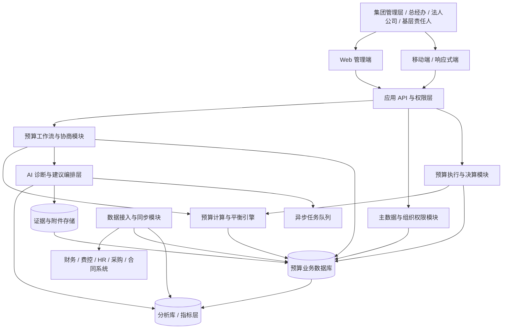
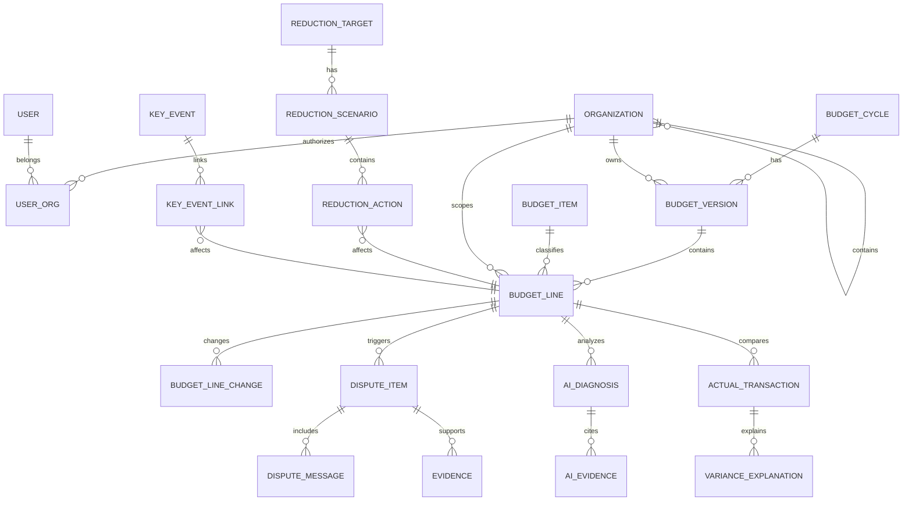

# 三安光电 AI 费用预决算管理系统

## 软件设计架构分析 V1

> 分析依据：需求调研稿 V1、当前桌面/移动端 Demo 设计方案 v0.5、现有 Demo 源码  
> 分析性质：从业务需求推导目标架构，并评估当前 Demo 与目标架构的差距  
> 当前结论：Demo 可作为交互验证层；正式系统需要补齐后端、数据治理、工作流、计算引擎、AI 证据链和审计能力。  
> 文档定位：本文为**技术设计视角**，仅保留技术骨架（分层架构、ER 与字段、计算/规则/AI 边界、代码演进、非功能要求、AI 技术可行性与技术侧待确认）。产品决策（双轨、一期目标、模块产品定义、业务流程、待拍板清单）以《产品设计稿 V1》为准，本文不重复产品论述。

---

## 1. 总体判断

### 1.1 当前 Demo 的技术形态

当前 Demo 是一个纯前端单页应用，主要特征如下：

- `website/index.html` 负责页面骨架和脚本加载；
- `website/app.js` 负责初始化、角色进入、页面路由和 Copilot 交互；
- `website/data/data.js` 集中保存组织、角色、预算科目、单据、项目和规则模拟数据；
- `website/core/state.js` 负责前端状态、业务操作和 `localStorage` 持久化；
- `website/core/engine.js` 使用关键词和确定性规则模拟 AI 对话；
- `website/views/` 按页面拆分渲染逻辑；
- 移动端基本是独立的一套页面和脚本，复用思路多于代码复用。

这套结构适合快速验证以下问题：

1. 管理者是否理解“预算总览—诊断—建议—执行”的交互路径。
2. 角色、预算编制、预算追踪、决算和 Copilot 是否形成可演示闭环。
3. 自上而下/自下而上、预算调剂和 AI 归类是否符合用户直觉。

但它不具备正式系统所需的多租户数据隔离、多人并发、版本审计、真实接口、权限控制和可靠计算能力。

### 1.2 目标系统的核心架构判断

建议采用：

> **模块化单体应用 + 统一预算数据模型 + 确定性计算引擎 + AI 决策支持层 + 异步数据集成能力**

第一阶段不建议直接采用微服务。原因是当前最重要的风险不是服务规模，而是：

- 预算口径还需要客户确认；
- 组织、科目、项目和关键事件的主数据关系尚未稳定；
- 预算版本、争议项和压降方案需要统一事务；
- 组织汇总、项目汇总和集团总额必须在同一套计算规则下保持一致。

在业务模型稳定、数据量和集成量明确后，再将数据接入、AI 任务或报表查询拆分为独立服务。

---

## 2. 目标分层架构



### 2.1 交互层

包括桌面 Web 和移动端/响应式端：

- 集团预算总览；
- 法人公司预算工作台；
- 基层责任人编制和解释入口；
- 预算争议协商工作区；
- AI 诊断与证据链；
- 压降方案模拟器；
- 执行追踪和决算复盘。

交互层只负责展示、收集用户操作和调用 API，不应在浏览器中持有集团预算的权威状态，也不应由前端直接决定最终金额、审批结果或权限范围。

### 2.2 应用服务层

应用服务层负责将用户动作组织为业务用例：

- 创建预算编制任务；
- 提交法人公司预算；
- 生成集团建议版；
- 创建预算争议项；
- 提交解释和证据；
- 生成和采纳压降方案；
- 执行预算版本调整；
- 导入实际执行数据；
- 形成决算差异解释；
- 确认下一年度基线。

应用服务层应统一处理权限、状态转换、事务、审计事件和计算触发，避免把业务规则散落在各个页面中。

### 2.3 领域模块层

建议按业务能力划分模块，而不是按页面划分模块：

| 模块 | 主要职责 |
|---|---|
| 组织与权限 | 集团、法人公司、部门、责任人、角色、数据范围和授权 |
| 主数据 | 费用科目、预算项目、单位、标准、供应商、合同属性 |
| 预算编制 | 编制任务、编制方式、明细、公式、依据和提交 |
| 预算版本 | 申报版、建议版、调整版、批准版及版本差异 |
| 预算协商 | 差异检测、争议项、解释、证据、协商状态和共识结果 |
| AI 诊断 | 合理区间、异常识别、归因、建议金额和风险 |
| 水分与压降 | 潜在压降项目池、弹性属性、压降目标和方案模拟 |
| 关键事件 | 一次性/延续性事项及其对预算基线的影响 |
| 执行与决算 | 实际费用、执行率、预算偏差、差异分类和基线修正 |
| 规则与指标 | 管理标准、预算规则、指标口径和计算版本 |
| 审计与证据 | 操作记录、变更原因、附件、AI 证据和审批轨迹 |

---

## 3. 业务域与数据关系

### 3.1 推荐的核心实体关系



### 3.2 预算明细必须具备的维度

当前调研稿中的“组织 × 预算项目 × 时间 × 预算版本”是最小核心，但正式实现建议扩展为：

> **集团/法人组织 × 部门/责任单位 × 费用科目 × 预算项目 × 时间 × 预算版本 × 预算场景 × 数据口径**

建议字段包括：

| 维度/字段 | 说明 |
|---|---|
| `organization_id` | 归属集团、法人公司或部门 |
| `budget_item_id` | 费用预算项目 |
| `account_id` | 财务科目或管理科目 |
| `period` | 年、季度、月；支持年度预算分解 |
| `version_id` | 预算版本，不允许直接覆盖历史版本 |
| `scenario` | 正常经营、关键事件、压降方案等 |
| `amount` | 预算金额 |
| `quantity` / `unit_price` | 数量×单价编制依据 |
| `driver_type` / `driver_value` | 人数、车辆数、面积、业务量等驱动因子 |
| `standard_id` | 人均标准、管理标准或最低保障标准 |
| `elasticity` | 刚性、替代性、延期性、合同锁定等属性 |
| `event_id` | 关联关键事件，区分一次性和持续性影响 |
| `basis_ref` | 编制依据和证据引用 |
| `status` | 草稿、提交、协商、批准、冻结等状态 |

### 3.3 版本模型不能只做字段标记

建议采用“版本头 + 版本明细 + 变更记录”的结构：

- 版本头：年度、组织、版本类型、状态、创建人、创建时间、来源版本；
- 版本明细：每个预算项目的金额和计算依据；
- 变更记录：旧值、新值、差额、原因、操作人、证据、关联争议项；
- 发布快照：批准后形成不可变快照，用于执行和决算对比。

这样才能回答“集团为什么把厦门公司车辆费从申报版调整到集团调整版的金额”“该调整依据是什么”等管理问题。

---

## 4. 关键业务流程的架构实现

### 4.1 预算编制

建议将编制拆成“编制任务—预算草稿—校验—提交”四层：

1. 创建年度编制任务，指定组织、责任人、截止时间和适用规则。
2. 责任人通过历史参考、同比、标准、驱动因子或人工方式产生预算明细。
3. 计算引擎校验数量、单价、汇总关系、最低保障和组织边界。
4. 生成法人公司申报版，不允许后续直接覆盖。

### 4.2 预算碰撞与协商

集团建议值不应直接覆盖公司申报值，而应形成独立的“建议/调整结果”：

```text
公司申报版
    ↓ 对比计算
集团建议版 + 差异解释 + AI 诊断
    ↓ 重大差异识别
预算争议项
    ↓ 多轮解释与证据补充
协商结果
    ↓ 人工确认
集团调整版
    ↓ 最终批准
批准版快照
```

争议项建议使用状态机：

```text
identified → raised → awaiting_explanation → analyzing
           → negotiating → agreed / rejected / escalated
```

每次状态变更都应生成审计事件；AI 重新分析应产生新诊断记录，而不是覆盖上一轮结论。

### 4.3 AI 预算诊断

AI 不应直接从前端页面读取零散字段并给出不可追溯回答，建议采用以下编排：

```text
预算项目
  ↓
指标查询与特征计算
  ↓
规则初筛 / 异常检测
  ↓
证据检索（历史、实际、人员、业务量、标准、事件）
  ↓
AI 解释与建议生成
  ↓
结构化诊断结果
  ↓
人工复核与采纳/驳回
```

AI 输出建议固定为结构化对象：

```json
{
  "verdict": "review",
  "reasonable_range": {"min": 0, "max": 0},
  "suggested_amount": 0,
  "reasons": [],
  "evidence_refs": [],
  "risks": [],
  "missing_data": [],
  "confidence": 0,
  "model_version": "..."
}
```

其中金额、比例、执行率和压降目标必须由确定性计算服务提供；模型只负责解释、归纳、分类和提出候选建议。

### 4.4 智能压降

压降不是简单的排序减法，建议拆为：

1. 目标管理：集团年度压降目标、目标口径和截止时间。
2. 候选池：预算水分、低执行率、异常单位成本、可替代性等指标筛选。
3. 约束集：最低保障、合同锁定、业务影响、关键事件和不可压降项目。
4. 方案计算：生成一个或多个候选方案。
5. 模拟比较：比较压降金额、覆盖组织、业务风险和剩余目标。
6. 人工采纳：将方案转化为预算调整动作或协商任务。

压降方案必须是可回滚、可比较的场景，不应直接改写正式批准版预算。

### 4.5 决算闭环

实际费用导入后，先进行数据归属和口径校验，再进行差异分析：

```text
实际数据接入
  ↓
组织/科目/项目映射
  ↓
重复、缺失、跨期、关键事件校验
  ↓
预算 VS 实际
  ↓
差异分类与业务解释
  ↓
基线修正建议
  ↓
下一年度预算编制
```

关键事件需要在决算时参与“是否剔除、是否延续、是否纳入基线”的判断，不能只作为备注字段保存。

---

## 5. 计算、规则和 AI 的边界

| 能力 | 应由谁负责 | 原因 |
|---|---|---|
| 预算加总、组织汇总、压降金额 | 确定性计算引擎 | 必须可复算、可审计 |
| 执行率、同比、单位成本 | 指标服务/计算引擎 | 统一口径，避免页面各算各的 |
| 最低保障、合同锁定、不可压降 | 规则引擎 | 管理制度必须显式化 |
| 异常初筛 | 规则 + 统计模型 | 先保证边界和稳定性 |
| 历史与证据归纳 | AI 分析层 | 提升解释效率 |
| 预算建议金额 | 计算约束 + AI 候选 | AI 不能绕过硬约束 |
| 最终批准、争议结论 | 人工管理者 | 责任和授权不能转移给模型 |

核心原则：

> **AI 可以建议“为什么”和“可选方案”，确定性引擎决定“怎么算”，管理者决定“是否采用”。**

---

## 6. 当前 Demo 与目标架构差距

| 需求能力 | 当前 Demo 状态 | 目标系统需补齐 |
|---|---|---|
| 多集团/多法人组织 | 只有模拟中心和部门，未建法人层 | 组织树、法人边界、数据权限和组织有效期 |
| 预算版本 | `plan.status` 有流程状态，但没有完整版本实体 | 版本头、明细快照、差异和不可变批准版 |
| 预算编制 | 支持自上而下/自下而上和自由语言归类 | 编制任务、公式、标准、驱动因子、多人协作 |
| 预算争议 | 有 AI 建议和调整入口，但无争议实体 | 争议状态机、多轮消息、证据、协商结果 |
| AI 诊断 | `engine.js` 为关键词规则和固定文本 | 特征计算、数据检索、模型编排、证据链和评估 |
| 水分识别 | 主要通过预置 `forecast` 展示 | 可解释指标、阈值版本、候选池和人工复核 |
| 智能压降 | 有固定调剂建议 | 目标、约束、场景、方案比较、回滚和审批 |
| 预算弹性 | 当前主要是界面概念 | 项目属性、规则权重、最低保障和风险模型 |
| 关键事件 | 未形成独立业务对象 | 事件登记、金额拆分、持续性和基线处理 |
| 数理平衡 | 部分页面本地计算，数据源分散 | 统一计算服务、事务、一致性校验和重算 |
| 实际/决算 | Mock 单据和前端导入 | 外部系统接入、映射、对账、差异处理 |
| 权限与审计 | URL 角色切换和前端过滤 | 服务端鉴权、组织级数据权限、操作审计 |
| 持久化 | 浏览器 `localStorage` | 服务端数据库、附件存储、备份和恢复 |
| 并发与协作 | 单浏览器状态 | 乐观锁、版本冲突、任务通知和协作记录 |
| 移动端 | 独立拷贝，存在重复维护风险 | 响应式/共享领域 API/统一权限与状态 |

### 6.1 当前 Demo 最需要修正的架构认知

当前 Demo 中的“AI”主要是确定性演示逻辑，不应在客户沟通或技术方案中表述为已经接入真实大模型。更准确的说法是：

> 当前已完成 AI 交互形态和决策卡片的体验验证；真实 AI 能力需要在后端数据、指标和证据体系确定后接入。

---

## 7. 推荐的实施架构阶段

### 阶段 0：业务与数据口径确认

- 确认集团、法人公司、部门和责任人组织关系；
- 确认费用项目、财务科目和管理口径；
- 收集 1～2 家典型法人公司预算/决算数据；
- 复盘 2～3 个真实预算争议案例；
- 定义关键事件、预算弹性和不可压降规则。

### 阶段 1：模块化单体 MVP

优先实现：

- 组织与权限；
- 主数据；
- 预算编制与版本；
- 法人公司提交；
- 集团建议与差异对比；
- 预算争议和证据留痕；
- 确定性汇总/平衡引擎；
- 基础执行导入和预算对实际分析。

### 阶段 2：AI 决策支持

- 历史/实际数据指标层；
- 预算异常检测；
- 预算水分候选池；
- 证据检索和 AI 诊断；
- 业务解释结构化；
- AI 建议的人工采纳和反馈闭环。

### 阶段 3：智能压降与基线闭环

- 预算弹性与约束规则；
- 压降目标和场景模拟；
- 关键事件基线处理；
- 决算差异归因；
- 下一年度基线自动建议。

### 阶段 4：系统集成与规模化

- 财务/费控/HR/采购/合同系统接口；
- 定时同步和数据质量监控；
- 报表与管理驾驶舱；
- 异步任务和大规模分析；
- 在有明确边界后再考虑拆分独立服务。

---

## 8. 非功能架构要求

### 8.1 数据安全

- 集团、法人公司和部门数据必须服务端隔离；
- 敏感金额、人员和供应商信息按权限脱敏；
- AI 调用前进行数据分级和最小化传递；
- 附件和证据需要访问控制、病毒检查和保留策略；
- 不允许把生产数据、密钥或完整财务数据放入前端代码。

### 8.2 可审计性

预算金额、版本、AI 结论、压降方案和最终批准都必须可追溯：

- 谁在什么时间做了什么操作；
- 修改前后是什么值；
- 为什么修改；
- 使用了哪些数据和证据；
- AI 使用了什么规则/模型版本；
- 最终由谁批准或驳回。

### 8.3 可解释性

系统展示 AI 结论时至少提供：数据来源、计算口径、关键因素、缺失数据、风险和人工确认项。不能只展示一个“合理/不合理”标签。

### 8.4 一致性与可靠性

- 汇总结果由后端统一计算；
- 预算版本发布采用事务和幂等操作；
- 导入数据必须支持重复导入检测和失败重试；
- 计算规则和指标口径要有版本；
- 关键操作支持回滚或生成反向调整记录；
- 日志、指标和任务失败信息应可监控。

---

## 9. 对当前代码演进的建议

### 9.1 保留 Demo 层的价值

当前 `website/` 不必立即重写。它可以继续承担：

- 客户访谈演示；
- 角色与页面验证；
- 预算协商、压降和 Copilot 交互原型；
- 未来 API 合同的前端试验。

### 9.2 下一步代码拆分方向

当前全局 `BM` 对象适合 Demo，但正式开发前建议逐步拆分为：

```text
frontend/
  pages/                 # 页面和路由
  components/            # 复用组件
  api/                   # 后端 API 客户端
  stores/                # 前端展示状态
  permissions/           # 前端能力显隐，不承担安全边界

backend/
  modules/
    organization/
    master-data/
    budgeting/
    negotiation/
    diagnostics/
    reduction/
    execution/
    settlement/
    audit/
  calculation/
  workflows/
  integrations/
  jobs/

data/
  migrations/
  fixtures/
  metric-definitions/
```

前端页面应逐渐从“直接改 `BM.state`”转为调用领域 API，例如：

```text
POST /api/budget-cycles/{id}/versions
POST /api/budget-versions/{id}/submit
POST /api/disputes/{id}/messages
POST /api/diagnostics/budget-lines/{id}/run
POST /api/reduction-scenarios
POST /api/settlements/{id}/baseline-review
```

这些接口只是架构示例，具体 URL 应在 API 设计阶段统一确定。

---

## 10. 技术侧待确认问题

> 产品 / 业务侧待确认问题（多集团租户、法人横向查看、科目映射关系、版本审批关系、争议线上/线下、关键事件台账、压降分解维度、预算弹性制度、会议纪要效力等）已归集至《产品设计稿 V1》§8.2。本文仅保留技术实现侧待确认。

1. 财务 / 费控 / HR / 采购 / 合同系统是否提供接口或定期文件（影响集成层与 §9 设计）。
2. AI 是否允许使用企业内部数据训练 / 微调，还是只能检索增强生成（影响 §13 技术路线）。
3. 生产环境部署位置、账号体系、单点登录和数据保留要求（影响 §8 非功能与部署形态）。
4. 对外部模型调用、敏感数据脱敏和供应商合规有什么限制（影响 §8 数据安全技术设计）。

---

## 11. 架构结论

本项目的核心不是增加一个预算填报页面，而是建立一条可信的管理决策链：

> **主数据可信 → 预算版本可追溯 → 差异可解释 → 协商有证据 → 压降可模拟 → 执行可对账 → 决算能修正基线**

因此，正式系统的优先级应为：

1. 先统一组织、项目、口径和版本模型；
2. 再建设确定性计算、平衡和审计能力；
3. 然后接入 AI 诊断、水分识别和压降建议；
4. 最后扩展外部系统集成和规模化分析。

当前 Demo 已经验证了产品交互方向，但不能替代上述业务基础设施。建议将它定位为“客户验证前端”，以 API 合同和真实样例数据为下一阶段架构演进的起点。

---

## 12. 双层驱动的技术实现视角

> 产品模式决策（约束/冲突驱动 vs 角色辅助决策驱动的选择、优缺点、适用场景、落地顺序）见《产品设计稿 V1》§5.7。本文仅说明技术上必须支撑的能力。

系统须同时支撑两条驱动路径，且二者共用同一套预算版本、约束、证据与计算模型：

- **集团约束层**：会议纪要 / 管理目标 / 正式通知解析为正式约束、目标与冲突项，经集团级方案引擎生成跨组织优化方案，下发到法人公司、部门与责任人。
- **角色 Copilot 层**：个人用自然语言补充实际要求、业务依据与系统外约束，生成可修改预算草稿与解释材料，回到集团级计算、平衡、协商与审批。

技术实现要点：

- **约束对象实体**：区分全局约束、部门 / 局部约束、待确认约束；自然语言要求先形成「待确认约束」，经授权确认后才进入正式约束集合。
- **优先级引擎**：全局约束与局部要求冲突时按 法律/监管 > 集团正式 > 法人正式 > 部门确认 > 个人偏好 > AI 默认 解决（详见产品设计稿 §5.7）。
- **共用模型**：两层生成的预算建议都必须回到确定性计算引擎重新校验，输出区分「系统计算结果 / AI 建议 / 人工确认结果」。

自然语言约束的最小结构（技术契约）：

```json
{
  "source_type": "user_statement",
  "source_text": "领导要求今年车辆费用降低 10%",
  "constraint_type": "reduction_target",
  "scope": {"budget_item": "车辆费用", "organization": null},
  "target": {"operator": "reduce_by_rate", "value": 0.1},
  "effective_period": "待确认",
  "authority": "待确认",
  "evidence_refs": [],
  "status": "pending_confirmation"
}
```

系统随后应追问适用范围、生效周期、基准口径、不可压降项与确认人，只有授权角色确认后才进入正式约束集合。

---

## 13. AI 能力边界、投入条件与实现可行性

### 13.1 先区分“AI 能力”与“系统能力”

本项目中有些目标适合由 AI 完成，有些目标必须由确定性软件、数据工程和管理流程完成。不能把所有智能行为都归因于大模型。

| 目标 | AI 能否直接解决 | 更适合的实现方式 |
|---|---|---|
| 从会议纪要中提取预算要求 | 可以辅助 | 文档解析 + 结构化抽取 + 人工确认 |
| 把自然语言转成预算草稿 | 可以较好完成 | 大模型 + 主数据检索 + 计算校验 |
| 解释预算与实际差异 | 在数据充分时可以辅助 | 指标计算 + 证据检索 + AI 归因 |
| 识别连续低执行率 | 不需要大模型 | SQL/指标引擎/规则引擎 |
| 判断预算是否有水分 | 只能提供候选判断 | 统计规则 + 横向基准 + 业务复核 |
| 生成压降方案 | 可以生成候选方案 | 约束优化/场景计算 + AI 解释 |
| 保证组织汇总等于集团总额 | 不能依赖 AI | 确定性事务计算引擎 |
| 判断业务最低保障 | 不能单独可靠判断 | 管理规则、标准库和责任人确认 |
| 决定预算最终是否批准 | 不应由 AI 决定 | 授权流程和人工决策 |

核心判断：

> **AI 适合处理非结构化信息、复杂解释和人机协作；金额、比例、约束、权限和最终决策必须由可验证的软件机制控制。**

### 13.2 当前 AI 可以达到的能力层级

#### A 级：近期可稳定实现

这类能力主要依赖现有大模型、结构化数据和规则，不需要新的算法突破：

- 读取会议纪要、通知和业务解释；
- 提取金额、比例、组织、项目、时间和约束对象；
- 将自然语言编制意图归类到科目、项目和物料；
- 根据系统指标生成预算差异说明；
- 将业务方的口头解释整理成结构化依据；
- 生成预算填报草稿和修改建议；
- 对比多个预算版本并用自然语言说明变化；
- 根据已确定的规则生成管理摘要、待办和追问。

这部分是最适合作为首期 AI 价值验证的范围。

#### B 级：具备可行性，但必须依赖企业数据和规则

- 识别潜在预算水分；
- 判断预算项目的合理区间；
- 解释不同法人公司的单位成本差异；
- 识别哪些费用具有延期、替代或压缩空间；
- 结合人员变化、业务量和关键事件判断同比异常；
- 对会议纪要约束和预算编制结果进行一致性检查；
- 生成多个压降方案并解释业务影响。

这类能力的关键不在于更强的聊天模型，而在于：数据口径、指标定义、同类样本、约束规则和历史案例是否可靠。

#### C 级：不能承诺完全自动化

- 自动判断某个管理要求是否真实有效；
- 自动判断一个费用是否“必须发生”；
- 自动替代集团总经办与法人公司协商；
- 自动决定最低业务保障线；
- 自动对所有公司作出公平且无争议的横向比较；
- 自动承担最终预算批准责任；
- 在数据缺失、口径冲突时仍保证结论正确。

这些任务可以由 AI 提供分析和候选方案，但必须保留授权确认、业务复核和责任归属。

### 13.3 AI 要实现目标所需的投入

#### 1. 数据投入

至少需要形成以下数据基础：

- 组织架构、法人关系、部门和责任人；
- 费用项目、财务科目和映射关系；
- 近 2～3 年预算数据；
- 近 2～3 年实际执行和决算数据；
- 月度或季度执行明细；
- 人员数量、组织变化和业务量驱动数据；
- 合同、供应商、价格和锁定期限；
- 历史预算调整和争议案例；
- 关键事件及其一次性/延续性判断；
- 行政管理标准、最低保障标准和不可压降规则。

如果只有几张年度汇总表，AI 可以做摘要和问答，但很难可靠判断预算水分、单位成本和压降空间。

#### 2. 业务专家投入

需要集团总经办、法人公司行政负责人、财务和基层责任人共同参与：

- 确认预算项目和统计口径；
- 标注哪些历史预算属于异常或一次性事项；
- 解释不同法人公司之间的业务差异；
- 确认哪些费用可以压降、延期或替代；
- 审核 AI 输出并反馈“为什么对/为什么错”；
- 建立可复用的预算争议案例库。

AI 不会自动发现企业隐含的管理规则。很多规则必须由业务专家显式说出来，并转化为系统可执行的标准。

#### 3. 数据工程投入

- 数据接入和文件解析；
- 组织、科目、项目和供应商主数据映射；
- 历史数据清洗和重复处理；
- 实际费用与预算项目的归属匹配；
- 单位、币种、周期和跨期口径统一；
- 数据质量检查、缺失率和异常值监控；
- 指标层和特征层建设。

这部分通常比接入大模型更决定最终效果。

#### 4. 系统工程投入

- 预算版本和变更审计；
- 权限和组织级数据隔离；
- 确定性计算与平衡；
- 工作流和协商状态机；
- 证据、附件和引用管理；
- AI 任务编排、重试和失败处理；
- 模型输入输出记录；
- 人工采纳、驳回和回滚。

#### 5. 持续运营投入

- 持续维护组织和预算主数据；
- 定期复核规则和管理标准；
- 评估 AI 误判、漏判和无依据结论；
- 维护提示词、检索内容和模型版本；
- 维护异常案例和业务反馈；
- 每年预算周期前重新校验指标口径。

AI 不是一次性交付的功能，而是需要随着预算周期持续校准的业务能力。

### 13.4 需要的知识突破是什么

本项目未必需要基础模型层面的重大突破，更现实的“知识突破”集中在企业业务知识工程：

#### 1. 把隐性管理经验变成显性规则

例如“车辆费用不能简单按去年执行额下降”“食堂费用要结合就餐人数和原材料价格”“物业费受合同锁定影响”。这些经验需要转化为：

- 适用范围；
- 判断条件；
- 例外情况；
- 最低保障；
- 可执行动作；
- 责任人和确认机制。

#### 2. 建立预算项目知识图谱

需要建立以下关系：

```text
组织 → 责任部门 → 预算项目 → 财务科目
预算项目 → 业务量驱动 → 管理标准
预算项目 → 合同/供应商 → 价格和锁定期限
预算项目 → 关键事件 → 一次性/延续性
预算项目 → 历史实际 → 单位成本和执行趋势
预算项目 → 弹性属性 → 可压降动作和风险
```

#### 3. 建立企业自己的案例库

预算水分和合理性往往不是通用知识，而是企业内部的判断传统。需要积累：

- 哪些预算后来被证明有水分；
- 哪些预算看似增长但属于合理增长；
- 哪些压降方案最终影响了业务；
- 哪些会议要求最终没有执行；
- 哪些一次性事件不应作为下一年度基线。

#### 4. 建立“建议结果”的评价标准

不能只评价 AI 是否说得像人，还要评价：

- 金额是否算对；
- 证据是否真的支持结论；
- 是否识别了关键约束；
- 是否遗漏了重要风险；
- 建议是否被业务人员采纳；
- 采纳后实际结果是否改善。

### 13.5 推荐工具链

#### 数据与计算工具

- 关系型数据库：保存组织、预算、版本、执行和审计数据；
- 数据导入与清洗工具：处理 Excel、CSV 和财务系统导出数据；
- SQL/指标引擎：执行预算、实际、同比、执行率和单位成本计算；
- 任务调度工具：定时同步、批量计算和年度预算任务；
- 数据质量工具：检查缺失、重复、映射失败和异常波动。

#### AI 工具

- 大语言模型：自然语言理解、解释、归纳和方案草拟；
- 文档解析/OCR：处理会议纪要、通知、扫描件和附件；
- 向量检索或混合检索：查找制度、历史案例、预算依据和会议材料；
- 工具调用：让模型调用指标查询、版本对比、场景计算和证据查询；
- 结构化输出校验：保证模型返回金额、组织、项目和约束字段符合数据模型；
- 模型评测工具：测试抽取准确率、证据命中率、建议采纳率和幻觉率。

#### 业务协作工具

- 约束确认工作台；
- 预算争议协商记录；
- AI 建议采纳/驳回/修改反馈；
- 证据附件和来源管理；
- 管理规则维护和版本发布；
- AI 诊断结果抽样复核。

### 13.6 推荐的 AI 技术架构


AI 不应直接连接数据库后自由生成金额结论。正确方式是：模型调用经过授权的指标和业务工具，计算结果由工具返回，模型负责组织解释和候选方案，最终由校验器和人工确认把结果写入预算版本。

### 13.7 分阶段判断 AI 能做到什么

| 阶段 | 可交付能力 | 可靠程度 | 主要前提 |
|---|---|---|---|
| P0 Demo | 固定场景问答、建议卡片、自然语言归类 | 仅用于体验验证 | Mock 数据和确定性规则 |
| P1 助手 | 角色输入约束、生成预算草稿、解释历史数据 | 中等 | 结构化主数据和指标查询 |
| P2 诊断 | 异常识别、差异归因、证据链和建议金额 | 有条件可靠 | 2～3 年可用历史数据、规则和专家复核 |
| P3 优化 | 多方案压降、跨公司比较、业务风险权衡 | 依赖企业成熟度 | 弹性规则、约束模型和跨组织数据 |
| P4 闭环 | 决算反馈影响下一年度基线并持续学习 | 长期建设 | 连续预算周期、结果反馈和治理机制 |

### 13.8 AI 投入与预期收益的匹配

建议不要一开始承诺“AI 自动完成预算管理”，而应按以下收益层级评估：

1. **效率收益**：减少人工查表、汇总、解释和材料编写时间。
2. **质量收益**：减少漏项、错项、口径不一致和缺少依据的预算。
3. **决策收益**：更早发现异常，提供可比较的调整方案。
4. **治理收益**：把会议要求、预算争议和压降结果沉淀为可追踪资产。
5. **财务收益**：经过多个预算周期验证后，才评估实际节省金额和成本改善。

前两层通常可以较早验证；后三层需要真实数据、管理规则和持续运营，不能仅凭 Demo 或一次模型问答证明。

### 13.9 最终可行性判断

本项目的 AI 目标可以实现，但应重新定义为：

> **AI 帮助企业理解约束、解释预算、发现候选问题并生成可比较方案；系统保证计算、权限、证据和版本可信，管理者负责最终判断。**

可以较有把握承诺的首期能力：

- 自然语言录入约束并生成待确认结构；
- 基于真实历史数据生成预算草稿；
- 对预算与实际差异进行证据化解释；
- 帮助角色补充业务依据和编制说明；
- 对候选压降项目进行排序和初步建议。

不应在资料未验证前承诺的能力：

- 自动准确识别所有预算水分；
- 自动决定跨法人公司的公平压降比例；
- 自动替代集团与法人公司的协商；
- 自动确认会议纪要或口头指令的正式效力；
- 自动批准预算或承担管理责任。

因此，项目的关键投入顺序应是：

> **先建数据和规则底座，再建 AI 诊断；先实现可解释建议，再逐步实现跨组织优化。**

---

## 14. 约束管理的技术实现（会议驱动模式的技术视角）

> 产品模式决策（会议纪要全局驱动 vs 个人理解后辅助编制的选择、适用场景、审计重点、确认问题）见《产品设计稿 V1》§5.7。本文仅说明约束管理的技术实现。

系统采用三级约束结构，区分三类信息的存储与生效：

1. **会议原始内容**：原文、会议时间、参与人、附件与来源。
2. **正式全局约束**：经授权确认，可影响相关编制检测与预算审批。
3. **个人 / 部门局部理解**：用户输入的解释、补充条件与局部建议，默认不直接覆盖全局约束。

约束检测优先级（技术规则）：

```text
法律/监管要求 > 集团正式约束 > 法人公司正式约束 > 部门已确认约束 > 个人编制偏好 > AI 默认建议
```

当局部业务确需突破全局约束时，系统标记冲突、要求补充业务依据、生成例外申请或预算争议项（见 §4.2 状态机）、指向有权审批人并保留处理结果。三类信息必须区分保存，确保全局约束、局部理解与原始会议内容均可追溯。