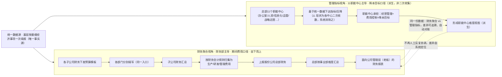

# 三安光电 AI 费用预决算管理系统

## 需求调研稿 V2

> 文档性质：商务阶段需求调研与产品讨论稿（会议纪要已确认一期范围）  
> 适用范围：集团总部、法人公司及基层费用责任部门  
> 当前版本：V2（会议纪要确认版）  
> 文档状态：**一期范围已客户确认**（2026-08-21 正式会议纪要《三安光电预算管理系统需求讨论会议纪要》确认双轨流程、一期三目标、明确不做清单；2026-08-20 三份客户真实业务资料已部分闭环组织/科目/规则字典）  
> 演进说明：V2 在 V1 基础上，吸收（1）2026-08-20 三份客户真实业务资料（组织对照表、科目明细表、预算逻辑表），（2）2026-08-21 正式会议纪要。纪要已把"双轨预算流程、一期三建设目标、暂不实施内容、协商闭环、费控单向导入、AI 风险筛查定位"等从'推测'升级为'客户确认结论'。本稿以会议纪要为权威来源重组，并将其与三份资料已验证的事实融合。

---

## 1. 项目定位

本项目拟建设一套面向集团型企业的 AI 费用预算管理系统，覆盖预算编制、预算协商、预算调整、执行分析、决算复盘和下一年度基线修正。

系统不以传统的"预算填报 + 审批流"为核心，而重点解决费用预算形成过程中长期存在的管理问题：

- 缺少预算决策依据；
- 集团与法人公司之间反复博弈、数据打架；
- 预算水分难以识别；
- 费用压降目标难以分解；
- 历史数据难以解释和复用；
- 预算、执行、决算之间缺少闭环。

### 1.1 产品核心定位

> 让预算编制有依据，让预算调整有证据，让成本压降知道从哪里下手。

### 1.2 一期建设目标（2026-08-21 会议纪要·"四、会议最终形成的阶段性结论"正式确认）

经双方讨论，本项目现阶段（一期）确定三个建设目标，按"统一预算数据 → 自动编制汇总 → 导入实际费用 → 预算执行跟踪 → AI 异常识别"路径逐步建设：

**目标一：预算编制及统计自动化（一期必须优先完成的基础目标）**
- 预算窗口统一（基层只填一次）；
- 科目统一（统一采用详细经济事项体系）；
- 统一填报；
- 自动汇总；
- 多维度报表（财务口径 / 管理口径 / 事业部 / 公司管理层）；
- 预算调整及确认（含总部建议与子公司反馈的协商闭环）；
- 提高查询和统计效率（应对"老板临时要新汇总、员工通宵重做"的痛点）。

**目标二：建立简单预算执行跟踪能力（暂不依赖费控系统做管控）**
- 由费控系统定期导出实际费用数据，再导入预算系统；
- 形成：预算与实际对比、执行率、超标展示、偏差分析、超标单位及科目预警；
- 一期以**事后分析和管理提醒为主**，不实施全面事前硬锁预算。

**目标三：加入 AI 费用风险识别能力**
- 在预算与实际数据基础上引入 AI 分析；
- 重点识别：疑似错用科目、疑似费用转移、费用异常增长、报销异常、预算结构与实际结构异常、高风险单位及高风险费用；
- AI **仅形成风险提示**，由管理人员进一步核查处理（AI 识别 → 风险提示 → 人工复核）。

### 1.3 一期暂不重点实施的内容（2026-08-21 会议纪要·"五、一期暂不重点实施的内容"明确划界）

双方初步确认，以下内容暂不作为一期核心范围（后续根据一期效果再扩展）：
- 全面改造现有费控系统；
- 替代现有报销系统；
- 强制事前锁预算；
- 复杂实时费控；
- AI 自动审批；
- AI 直接判定违规；
- AI 直接决定预算压降金额；
- 一次性建设完整集团财务管理平台。

> 边界纪律：一期只解决"预算收集难、重复填报多、科目不一致、汇总工作量大、预算与实际缺少有效跟踪"等最现实问题，不碰财务地盘的费控/报销系统硬改造。

---

## 2. 用户角色与组织关系

系统需支持集团、多法人公司、多事业部、多生产单元、多部门、多预算项目的矩阵式预算管理。

### 2.0 客户真实组织字典（V2 新增，来源：财务部费控系统预算数据收集模板）

客户实际组织维度为多层级矩阵，已由三份资料提供完整对照表：

| 维度 | 规模 | 来源 | 说明 |
|---|---|---|---|
| 公司代码 / 公司名称 | 十几家法人公司（独立法人、独立运营） | 文件3「公司代码公司名称对照表」（对照表列 43 个公司代码，含内部核算单位等非独立法人实体；其中独立法人、独立运营的子公司约十几家，会议纪要 §3.4.2 口径） | 1000 三安光电股份、2010 厦门三安、2020 天津三安、2030 安徽三安、2050 晶安光电、2120 香港三安、2170 泉州三安、2180 湖北三安、3050 湖南三安、3200 重庆三安、5010 芜湖安瑞、9010 安徽三首光电等 |
| 事业部 / 生产单元 | 约 40 个生产单元 | 文件3「事业部生产单元对照表」 | 氮化镓（厦门/南安 GaN）、砷化镓（南安 GaAs）、特种应用、射频、电力电子、安瑞、光通讯、北京三安、安徽科技、银泽、重庆、湖南等，含海外（日本/欧洲/香港） |
| 一级部门 | 42 个 | 文件3「一级部门对照表」 | 总经理室、研发\技术、运营、采购、品管、总经办、人资、财务、信息化、证券、基建、风控、动力、外延、芯片、晶体、设备、封装/封测、销售、市场等 |
| 预算归口部门 | 总办/人资/财务/品管/IT 等 | 文件3「费控系统预算科目明细表」 | 每个预算科目明确归口到一个职能部门，作为责任归属的硬属性 |
| 职能中心（管理维度主体） | 11 个 | 2026-08-21 客户会议口述 | 人资中心、办公室、品管中心、战略运营中心、风控、财务中心、信息化中心等；科目归口责任人（办公室约管 12 类科目、IT→信息化中心），负责"预算逻辑→预算管理→日常管控→数据统计→数据分析→降本任务目标"全链条 |

> 系统组织模型须支持上述"公司 × 事业部 × 生产单元 × 一级部门"的可配置层级，而非固定三级。

**费用归属 vs 预算归属错位（2026-08-21 会议确认 · 第三重错位）**：员工劳动关系（买社保发工资）可能挂在厦门岛内某销售公司，合同关系在销售公司 → **费用走销售公司**，但**预算在总部**。即"费用归属（法人/劳动关系）≠ 预算归属（总部/管理口径）"，费控系统至今未扯清，也是牵头人不愿沾费控系统的原因之一。系统组织模型需同时记录两者的归属并可映射。

### 2.1 角色与职责（V2 在 V1 基础上补充"归口责任"属性）

| 组织层级 | 角色 | 主要职责 |
|---|---|---|
| 集团层 | 集团 CEO / 管理层 | 关注集团总额、压降目标、重大争议和最终决策 |
| 集团层 | 集团总经办负责人 | 组织费用管理、审核法人公司预算、推动协商与压降 |
| 集团层 | 集团总经办预算管理人员 | 汇总、分析、调整、跟踪和维护预算数据 |
| 法人公司层 | 法人公司负责人 | 审核本公司费用预算并参与重大调整 |
| 法人公司层 | 公司行政负责人 | 组织本公司预算编制、解释差异、落实压降 |
| 法人公司层 | 公司预算管理人员 | 汇总、校验、提交和维护公司预算 |
| 归口部门层（V2 新增） | 总办/人资/财务/品管/IT 等归口责任人 | 对所归口预算科目的专业标准、编制逻辑和解释口径负责（对应文件3「归口部门」字段） |
| 基层业务层 | 食堂管理 | 负责食堂相关费用预算和执行解释 |
| 基层业务层 | 车辆管理 | 负责车辆、维修、燃油等费用预算和执行解释 |
| 基层业务层 | 物业管理 | 负责物业、保洁、绿化、安保等费用预算和执行解释 |
| 基层业务层 | 宿舍管理 | 负责宿舍及配套费用预算和执行解释 |
| 基层业务层 | 差旅管理 | 负责差旅相关费用预算和执行解释 |
| 基层业务层 | 福利管理 | 负责员工福利及相关费用预算和执行解释 |
| 基层业务层 | 其他费用责任人员 | 负责其他费用项目的预算和执行解释 |

### 2.2 权限原则

- 集团可查看并管理集团及下属法人公司的汇总与明细数据。
- 法人公司可管理本公司及下属部门、预算项目数据。
- 基层责任人员原则上只维护本人负责的预算项目，并对业务依据和执行差异负责。
- 预算调整、版本发布和最终批准必须保留操作人、时间、原因及证据。
- 预算科目归口部门对该科目的编制逻辑与专业解释具有审核职责（V2 新增）。
- 具体权限边界需结合客户实际管理授权进一步确认。

---

## 3. 核心业务对象与数据模型

### 3.1 预算主数据结构（会议纪要确认：统一数据源 + 经济事项 → 会计科目映射）

V1 暂定义主结构为 `组织 × 预算项目 × 时间 × 预算版本`（四维，时间为年度）。

**V2 修正（来源：文件3 收集模板 + 2026-08-21 会议纪要 §5/§6）**：

> **统一源头数据（最细经济事项级） → 按规则自动生成多口径视图**

- 基层按**最细的经济事项**进行预算填报（单一事实源）；
- 系统内置「经济事项 → 财务会计科目」映射，自动按会计科目聚合出财务口径；
- 系统再按事业部、公司、管理层等维度自动派生管理口径视图。

主结构（落地模型）：

> **公司 × 事业部/生产单元 × 一级部门（组织维度） × 预算科目（含会计科目映射） × 时间（年 + 月度 1~12） × 预算版本**

示例：

- 三安光电股份（1000）× 氮化镓 × 南安生产单元(GaN) × 研发\技术 × 总办办公费 × 2026 年 × 1~12 月 × 公司申报版；
- 同口径 × 集团建议版；
- 同口径 × 子公司确认版；
- 同口径 × 最终批准版。

说明：

- **统一数据源（会议纪要核心共识）**：财务与职能管理两套体系"数据源如果存在两套，就很难真正解决一致性问题"——未来形成一个统一源头数据，在此基础上形成不同管理视图。基层只填报一次，系统自动生成财务/各职能中心/事业部/管理层所需数据（替代当前各中心分别找基层重复收数）。
- **组织维度**由 V1 的"组织"单层级，细化为"公司 / 事业部 / 生产单元 / 一级部门"四级可配置层级（与客户对照表一致）。
- **预算科目**须挂接"会计科目编码"（文件3「费控系统预算科目明细表」已提供完整映射），保证与财务核算口径打通；前端填报以约 390 项经济事项为细颗粒度，后端聚合到会计科目。
- **时间**由"年"细化为"年 + 月度分解"，满足月度执行跟踪与预算释放。
- 系统应完整保存预算形成过程中每一个版本及其变化原因，避免只保留最终结果而丢失协商过程。

### 3.2 建议的核心数据对象（V2 补充字典类对象）

| 数据对象 | 关键内容 |
|---|---|
| 组织 | 集团、法人公司、事业部、生产单元、部门、责任单位、组织层级关系 |
| 预算项目 / 科目 | **会计科目编码、费用类型、预算科目名称、归口部门、管理属性（V2 新增映射字段）** |
| 预算版本 | 申报版、集团建议版、集团调整版、最终批准版等 |
| 预算明细 | 金额、数量、单价、标准、业务量、编制依据、**月度分解（1~12 月，V2 新增）** |
| 预算争议项（协商记录） | 总部建议金额、子公司反馈金额、调整原因、最终确认金额、调整过程及版本（会议纪要 §9 正式确认需留存） |
| AI 诊断结果 | 合理区间、异常、原因、建议金额、依据、风险 |
| 压降方案 | 压降目标、涉及组织/项目、方案金额、业务影响、风险 |
| 关键事件 | 事件原因、时间、单位、项目、金额、一次性/延续性 |
| 实际执行（费控导入） | 公司、生产单元/事业部、部门、报销申请、单据、金额、费用说明、个人数据（会议纪要 §13 确认费控导出字段）；导入方式一期为人工 Excel，暂不强制 API |
| 差异解释 | 预算与实际差异、原因分类、是否影响下一年度基线 |
| 操作审计 | 操作人、时间、动作、旧值、新值、原因和附件证据 |
| 经济事项映射（V2 强化） | 经济事项 → 财务会计科目 的映射关系（会议纪要 §6：基层填最细事项，系统自动按会计科目聚合） |
| **组织字典（V2 新增）** | 公司代码表、事业部/生产单元表、一级部门表、11 职能中心表 |
| **科目字典（V2 新增）** | 经济事项（~391 项）/会计科目编码/二级三级分类/事项说明/管理归口单位 映射 |
| **规则字典（V2 新增）** | 科目级编制/压降规则；业务关联度、刚性/非刚性、新/成熟业务、可压降程度、历史执行等管理属性（会议纪要 §8） |

### 3.3 客户数据字典（V2 新增章节，吸收三份客户资料）

> 本节内容为已验证的客户事实，系统实现时应直接导入客户提供的源 Excel，而非手工重建。源文件见 `docs/product/` 下三份 2026-08-20 文档。

#### 3.3.1 组织字典

- **公司代码对照表（43 个公司代码，含独立法人子公司约十几家）**：1000 三安光电股份有限公司、2010 厦门市三安光电科技有限公司、2020 天津三安光电有限公司、2030 安徽三安光电有限公司、2050 福建晶安光电有限公司、2060/2070/2080 Luminus 系列（海外）、2120 香港三安光电、2170 泉州三安半导体科技、2180 湖北三安、3050 湖南三安半导体、3200 重庆三安半导体、5010 芜湖安瑞光电、9010 安徽三首光电等（完整 43 条见源文件；其中独立法人、独立运营的子公司按会议纪要口径约十几家）。
- **事业部生产单元对照表（约 40 单元）**：覆盖氮化镓、砷化镓、特种应用、射频、电力电子、安瑞、光通讯、北京三安、安徽科技、银泽、重庆、湖南等事业部，及厦门/南安/安溪/芜湖/鄂州/天津/重庆/湖南等生产单元，含日本、欧洲、香港等海外单元。
- **一级部门对照表（42 个）**：总经理室、研发\技术、运营、采购、品管、总办、人资、财务、信息化、证券、基建、风控、动力、外延、芯片、晶体、设备、封装/封测、销售、市场等。

#### 3.3.2 预算科目字典

- **全口径科目映射（来源：文件3「费控系统预算科目明细表」）**：结构为 `会计科目编码 → 所属分类 → 费用类型 → 预算科目名称 → 预算归口部门 → 编码`。例如：
  - `6600010201 人工-福利费用-宿舍费用 → 宿舍福利-房租 → 宿舍费用 → 总办（SA03）`
  - `6600010202 人工-福利费用-食堂费用 → 食堂福利-食堂耗材 → 食堂费用 → 总办（ZY103）`
  - `6600010203 人工-福利费用-其他福利费 → 其他福利-员工体检费 → 总办其他福利费 → 总办（SA21）`
- **总经办口径科目（来源：文件1「预算逻辑」）**：14 个预算科目，按管理责任部门划分为行政部、外联部、环安部、后勤部、总办，每个科目下列具体费用类型、经济事项说明，以及 2026/2027 预算逻辑。
- **经济事项主数据（2026-08-21 会议纪要 §5/§6 确认 · 单一事实源）**：现有费控系统导出的经济事项基础表已包含「会计科目编码、会计科目、二级分类、三级分类、具体经济事项、事项说明、管理归口单位」七类字段，全公司约 **300 多项、接近 390 项**经济事项，颗粒度较细（如同属"住宿费用"内部再细分多种场景，但均可归属到同一财务会计科目编码）。该表是费控系统建设期整理并统一过的，运营规则：所有单位都能在表里找到自己科目，找不到就**改这一张表、全员跟着改**（活的主数据，持续演进）。会议双方初步认可：**统一经济事项作为预算基础数据，再通过规则自动形成不同的财务和管理口径**。
- **关键对照（会议纪要 §5 量化）**：财务部门下发的预算模板只有约 **220 多个项目**，颗粒度相对较粗；而经济事项体系约 390 项，颗粒度更细。**未来方向**：将预算基础科目统一到更详细的经济事项体系上（吴总已在与财务沟通），实现"基层按最细事项填报 → 系统按会计科目自动聚合 → 财务口径自动生成、不再二次收集"（吴总确认财务原则上可接受）。
- **关键区分：管理归口单位（管理口径） vs 会计科目编码（财务口径）**：经济事项表的"管理归口单位"是管理口径的分工（对应 11 职能中心）；"会计科目编码"是财务核算口径。两者**未必一致**——这正是不一致的表层根源之一，系统需同时维护两套归属并通过"经济事项 → 会计科目"映射打通。

#### 3.3.3 编制 / 压降规则字典（来源：文件1「预算逻辑」，V2 提炼）

客户已把大量预算编制逻辑写成可执行规则，应沉淀为系统规则引擎（见 §5.10），要点：

| 规则类型 | 规则内容 | 适用科目示例 |
|---|---|---|
| 通用压降 | 较 2025 年实际费用下降 5% | 办公费、修理费、汽车费用、绿化（部分）、安全生产费（部分）、环保费（部分）等 |
| 人均标准 | 2026 移动电话费 = 2025 月人均费用 × 2026 可报销人数 | 移动电话费 |
| 营收比管控 | 有营收单位：营收比 ≤ 千分之4，费用增长率 ≤ 营收增长率的 50%；无营收单位：上年实际降 10% | 差旅费 |
| 食堂专项 | 人均用餐成本（不含人工）目标 7 元/人/餐 ±3%；>7.5 元须降至少 5%；食材占比 66%→68% | 食堂费用 |
| 宿舍阶梯 | 月人均 <13.5 元不降；13.5~18 元降 ≥10%（或降至 13.5）；≥20 元降 ≥15% | 宿舍费用 |
| 绿化分档 | 管养单价 3~3.5 元/㎡/年降 ≥5%；>3.5 降 ≥10%；<3 元自行设定 | 绿化费 |
| 按实际预算（需说明） | 据实预算，须详细说明依据 | 安全生产评估类、环保评估类、捐赠、搬迁、咨询审计、保险费、员工体检等 |

---

## 3.4 客户现状预算流程（客户会议确认版 · 2026-08-21 纪要）

> 2026-08-21 正式会议纪要确认：客户预算管理存在 **"财务预算线 + 职能管理预算线"两条业务线**，两条线当前均靠**手工做表**，且口径不一致导致每年冲突；双方已就"统一数据源、压降不能一刀切、压降须业务单位确认、短期不改造费控系统、费控数据单向导入"达成方向性共识。本节为会议纪要确认的真实流程，**替代**此前基于三份资料的单轨推测版。

### 3.4.1 双轨总览



> 吴总确认："两套数据目前确实经常出现不一致。例如管理中心按降本要求申报的差旅费可能已经下降，而财务按基层实际需求汇总的数据反而较高。" 最终汇报时**财务报的数据增加、职能中心报的数据下降**，每年预算过程财务和职能中心都要反复核对协调。

### 3.4.2 财务预算线（财务部主导 · 期间费用口径 · 自下而上）

1. 十几家子公司，子公司大部分同时是**生产基地**，也存在**部分销售型公司**，各子公司基本按**独立法人、独立运营**方式管理；
2. 每年由各子公司财务部门**下发预算模板**，各部门分别填写预算；
3. 填写完成后由子公司财务**汇总**，并按照**财务会计规则**归集为生产费用、研发费用、管理费用等相关费用类别；
4. 各子公司预算完成后，**上报股份公司总部财务**，由总部按照**事业部等维度**进行汇总，最终形成**面向公司管理层的财务预算报表**；
5. 吴总定位："财务预算更偏向于财务统计和财务报表呈现。"

### 3.4.3 职能管理预算线（11 职能中心主导 · 降本目标口径）

背景：股份公司总部目前有 **11 个职能中心**，包括办公室、人资中心、信息化中心、品管中心、战略运营中心等。每一个总部职能中心，又分别对应各事业部及各子公司的相关职能部门（例如办公室负责差旅费/办公费、人资中心负责人力/招聘、信息化中心负责 IT 设备/电脑）。各职能中心除统计费用外，还承担**经营管理、费用控制、降本目标**等职责。

流程：
1. 每个职能中心按照自己的管理口径，分别向各个子公司和业务单元**收集预算**（这就是"管理口径的二次填报"）；
2. 管理口径更细——基层填报的是实际发生事项，财务口径相对粗略（多个业务事项聚合到同一财务科目，也可能归口不一致）；
3. 历史上两张表的协同靠**人工**；会议双方共识：**把两张表的协同变成自动化**——把协同规则（经济事项 → 会计科目映射）搞出来。

### 3.4.4 基层重复填报问题（子单元最大痛点 · 纪要 §3）

总部有 11 个职能中心，但到了某些规模较小的子公司，可能一个"总管部"或同一个工作人员，同时对应总部五六个职能中心。于是总部不同中心分别找基层收数据时，实际上可能都是找同一个人。同一基层人员既要：给财务报一次、给办公室报一次、给人资报一次、给信息化等其他中心继续报——造成基层很大工作量，是基层对目前预算管理模式**意见较大的原因之一**。

> 本系统核心解法（纪要 §4 双方共识）：**建立统一入口，基层只完成一次预算填报，系统再根据不同管理规则自动生成财务/各职能中心/事业部/管理层所需数据**。

### 3.4.5 预算编制与压降流程（纪要 §7/§8/§9 修正此前"老板拍板"表述）

行政联盟最初判断职能管理预算是自上而下目标分解，吴总修正：**预算最初仍是各单位自下而上申报**，形态为三层结构：

1. **自下而上申报**：基层单位申报预算 → 各子公司/事业部汇总 → 总部汇总 → 向老板汇报；
2. **老板提压降目标（自上而下触发）**：老板看完总体预算后，可能提出"总费用下降一定比例 / 某费用类别下降一定金额 / 某些重点费用专项压降"，此时预算才进入自上而下调整过程（例：老板提出整体再降低 2000 万元，总部先按比例向各单位下达压降要求，再据业务情况协商）；
3. **压降不能一刀切（纪要 §8 新增管理属性）**：简单统一比例不够科学（如差旅费与业务增长高度相关，新拓市场单位强压反伤业务）。应给预算费用增加管理属性：与业务的关联程度、刚性/非刚性、新业务/成熟业务、可压降程度、历史执行情况；压降时优先从"与业务关联弱、金额大、弹性高"的费用找空间。吴总确认三安已有类似管理经验（新老业务不会用完全一致费用标准），但这些规则**目前靠管理经验、未形成制度**；同时部分业务比例/额度属管理敏感数据，**需保密和权限控制**；
4. **压降须经业务单位确认（纪要 §9 协商闭环）**：总部建议金额不能简单作为最终结果，子公司必须认可。例：总部建议降 100 万，子公司业务评估后认为只能降 50 万 → 系统允许子公司反馈"100 万无法全部接受，我方确认降 50 万"并填业务原因 → 总部可"接受 50 万 / 再次调整 / 继续沟通 / 最终形成双方确认金额"。系统须保存：总部建议金额、子公司反馈金额、调整原因、最终确认金额、调整过程及版本。

> 结论：协商机制真实存在，形态为"**自下而上申报 + 老板触发压降 + 自上而下下达 + 总部与子公司协商确认（带留痕）**"，比 V1 假设的"预算碰撞与协商"更结构化；本系统须把这套协商做成**可追溯的闭环**，而非靠拉明细施压。

### 3.4.6 现有费控系统定位与数据策略（纪要 §11/§12/§13 权威结论）

**现有"费控系统"定位澄清（重要）**：
- 虽然名叫"费控系统"，实际主要承担**电子报销**功能：能记录大量费用数据、导出详细报销数据，但**真正的预算控制能力较弱**；
- 现状细项：财务可导入预算、可按月度提示是否超预算、存在年度额度；但**月度超标而年度未超标时仍可继续报销**；预算不足时**可通过追加预算继续完成报销**；系统缺乏真正的**超预算跟踪、管理层预警、超标分析、自动处置机制**；
- 双方结论："当前费控系统本质上还是以完成报销流程为主要目标，而不是以预算管控为主要目标。"

**短期不改造费控系统（纪要 §12，吴总明确）**：
- 现有费控系统由财务负责管理，涉及公司内部部门职责和管理关系；牵头人已因预算长期困难才牵头此项目，**短期内不希望再直接介入或评价财务现有费控系统**；
- 三安希望预算项目与现有费控系统**暂时保持相对独立**，先把预算编制做好，再考虑后续如何利用费控数据。行政联盟对此认可。

**数据策略反转：费控数据单向导入（纪要 §13 落地路径 · 已确认）**：
- 既然 1~2 年内费控系统无法承担预算执行管理，关系反过来：**不要求预算系统依赖费控系统做管理，而是费控系统提供实际发生数据，预算系统负责后续执行分析**；
- 吴总现场展示费控导出数据已包含：公司、生产单元/事业部、部门、报销申请、单据、金额、费用说明、个人数据等（甚至可导出每人报销额度和标准）；
- 双方确定：**一期先采用人工 Excel 导入**，即"费控系统导出实际数据 → 导入预算系统 → 与预算数据匹配分析"，**暂不强制建设 API 实时接口**。

### 3.4.7 预算执行跟踪价值（纪要 §14 权威定性）

基于费控数据导入，预算系统可形成简单执行跟踪能力：本年度预算、本月实际、累计实际、剩余预算、执行率、超预算单位、超预算科目、异常增长单位。吴总认为**即使做不到事前硬管控，只做到事后发现也有价值**——通过每月通报/分析/追踪，"对本月问题的处理，本身就会影响相关单位下个月的行为"，形成"事后监督带动事前约束"的管理效果。

### 3.4.8 费用科目错报与规避预算问题（纪要 §15 待解难题）

子公司多、财务人员多，不同地方执行标准有差异，实际报销中可能出现：① 应记招待费的费用记到其他科目；② 为规避某科目超标将费用转另一科目；③ 相同业务在不同公司用不同科目。有些是业务理解不一致，也有部分为规避超标而调整。人工很难全面检查所有报销记录——这正是 AI 风险筛查的切入点（见 §5.11）。

### 3.4.9 子单元痛点汇总（对应 §3.4.4 及纪要 §3）

| # | 痛点 | 说明 |
|---|---|---|
| 1 | 对接窗口太多 / 重复填报 | 总部 11 中心分别找基层收数，小子公司"一个总管部对应五六个中心、下面都是同一个人"，同一人给财务/办公室/人资/信息化各报一遍 |
| 2 | 极耗时间 | 仅收集/统计/整理/汇总已耗大量人工；老板临时要新汇总时工作人员甚至通宵重做 |
| 3 | 数据不真实 | 十几个单位任一填错即整体失真；工厂多管不过来，有人乱填，无自动校验 |
| 4 | 两套数据打架 | 财务口径 vs 管理口径不一致，每年财务与职能中心反复核对协调 |

### 3.4.10 对系统的启示（V2 重整理 · 融合纪要）

1. **统一数据源 + 一次填报多口径复用**：基层填一次，系统自动生成财务/各中心/事业部/管理层视图（回应痛点 1/2，纪要 §4 核心共识）；
2. **经济事项 → 会计科目映射引擎**：以 ~390 项经济事项为细颗粒度填报，自动聚合财务科目，财务口径不再二次收集（纪要 §5/§6）；
3. **双口径（财务 vs 管理）对账**：两套数据可映射、可对比、可定位差异，替代"每年吵架 + 人工砍额"（纪要 §2）；
4. **降本目标分拆引擎 + 管理属性**：中心级降本目标自动分拆到单位并作基线；压降须结合业务关联度/刚性/新老业务/可压降程度等属性，不一刀切（纪要 §8）；
5. **协商闭环（带留痕）**：总部建议金额 ↔ 子公司反馈金额 ↔ 调整原因 ↔ 最终确认金额 ↔ 版本，支持"接受/再调整/继续沟通"（纪要 §9，对应本系统预算碰撞模块）；
6. **统一报送入口**：管理口径收集由牵头中心统一收口，所有单位往一个入口填，中心不再各自向子单元重复要数（回应"怨气重"）；
7. **科目主数据（单一事实源）**：~390 项经济事项表为唯一权威、持续演进（找不到就改表全员跟着改）；
8. **费控数据单向导入（一期 Excel）**：费控导出实际 → 导入预算系统做事后差异监控，不依赖/不改造费控系统（纪要 §13）；
9. **事后监督带动事前约束**：一期以事后发现/每月通报为主，不强制事前锁预算（纪要 §14）；
10. **管控层空缺 = 本系统定位**：现有费控系统只做报销、管控层空，本系统直接补"预算 vs 实际 差异监控 + 超标预警"，且绕开财务地盘（纪要 §11/§12）；
11. **对标按成熟度分组**：老厂/成熟模块费用率极低（千分级）、新模块高（百分比级），对标须按"成熟/新模块"分组，不跨组一刀切；
12. **AI 风险筛查（非判定）**：AI 从海量数据中"拎出"高风险对象（疑似错科目/费用转移/异常金额频率/结构异常/单位间异常差异），AI 识别 → 风险提示 → 人工复核（纪要 §16/§17）。


### 3.4.11 证据链（三份资料 + 正式会议纪要）

| 来源 | 对应环节 | 字段 / 证据 |
|---|---|---|
| 文件1 总经办科目逻辑 | 管理维度 规则制定与归口 | 管理责任部门列（归口划分）+ 2026年预算逻辑列（下降5%、食堂7元/餐、宿舍阶梯、营收比等） |
| 文件3 费控系统预算数据收集模板 | 财务维度 数据收集与编制 | 五维+月度标准模板、4 张对照表（公司/生产单元/部门/科目）、预算金额列全空待填 |
| 文件2 总经办预算汇报汇总空白表 | 财务维度 汇总/压降/跟踪 | 横跨 2022-2026、按几十家子公司/事业部横向排列、含预算达成率/差异率/说明列、实际数据回填 |
| 2026-08-21《三安光电预算管理系统需求讨论会议纪要》 | 双轨全流程 + 冲突机制 + 一期三目标 + 不做清单 + 协商闭环 + 费控单向导入 + AI 风险筛查定位 | 11 职能中心、基层重复填报（总管部对应五六个中心）、统一数据源共识、压降三层结构（自下而上到老板触发到自上而下协商）、费控定位（电子报销非管控）、费控导出字段、一期三目标与八项不做内容 |

### 3.4.12 仍需向客户进一步确认（纪要 §6 后续资料 + 讨论遗留）

1. 11 个职能中心的完整清单及各中心科目归口矩阵（纪要仅举例办公室/人资/信息化/品管/战略运营，需全清单）；
2. 财务口径（约220 项预算模板）与管理口径（约390 项经济事项）的科目映射与差异归因规则（哪些一一对应、哪些无法对应）；
3. 事业部与法人公司归属清单（老板视角按事业部聚合展示所需）；
4. 管理维度降本目标的基线年份与降幅确定方式（5%/10% 还是按中心单独定）；
5. 单家法人公司预算明细样例 + 预算执行/决算实际数据（纪要列为后续补充资料，仍待提供）；
6. 费用归属 vs 预算归属错位（劳动关系/合同在销售公司、费用走销售公司、预算在总部）的处理规则——对账与归因时须映射；
7. 费控系统导出频率与自动化程度（一期暂定人工 Excel，API 留待后续）；
8. 敏感数据权限控制规则：部分业务比例/额度属管理敏感数据，不宜单位间公开，需明确密级与可见范围；
9. 现有费控系统导出数据的个人额度/标准字段口径（纪要明确甚至导出每人报销额度和标准）。


---

## 4. 端到端业务流程

> 客户现状为"财务预算线 + 职能管理预算线"双轨手工预算（2026-08-21 会议纪要确认），两套口径不一致、每年反复核对协调。本系统的端到端流程在客户"有骨架"的基础上，重点落实会议纪要确认的一期三目标：**统一数据源自动编制汇总、费控数据单向导入做执行跟踪、AI 风险筛查**，并把"协商闭环、双口径对账、客户规则引擎"作为支撑能力。

```text
① 统一数据源准备（导入客户组织字典：十几家法人公司 / 事业部 / 部门 + ~390 项经济事项主数据 + 规则字典）
        ↓
② 基层一次填报（按最细经济事项，系统按映射自动生成财务/管理/事业部多口径视图）
        ↓
③ 法人公司/职能中心 汇总、校验并提交（含规则引擎预填基线 + 偏离校验）
        ↓
④ 集团总经办 AI 诊断与专业审核（规则校验 + 同类公司横向对标 + 成熟度分组）
        ↓
⑤ 公司申报值 VS 集团建议值（预算碰撞 → 形成争议项）
        ↓
⑥ 自上而下压降目标下达 + 自下而上子公司反馈协商（带留痕闭环：建议/反馈/原因/确认/版本）
        ↓
⑦ 人工调整、实时平衡与最终批准（版本管理）
        ↓
⑧ 费控系统导出实际数据 → 人工导入本系统（一期 Excel，单向）
        ↓
⑨ 预算 VS 实际执行跟踪（月度）：执行率/超标单位/超标科目/异常增长（事后监督带动事前约束）
        ↓
⑩ AI 风险筛查：疑似错科目/费用转移/异常增长/报销异常/结构异常/高风险单位（提示→人工复核）
        ↓
⑪ 差异解释、基线修正与下一年度预算
```

> 注：⑧⑨⑩ 为一期"目标二/三"内容，依赖费控导出数据；①②③④⑤⑥⑦ 为"目标一"内容，是必须先完成的基础。

---

## 5. 功能需求

### 5.1 预算编制（V2 补充规则驱动 + 月度分解）

基层预算责任人员根据下一年度业务需要编制预算。系统至少支持以下编制方式：

- 历史数据参考；
- 同比增长/下降；
- 固定金额；
- 数量 × 单价；
- 人均标准；
- 业务量驱动；
- 管理标准；
- 关键事件增加；
- 人工调整。

**V2 新增：客户规则驱动编制**。系统加载 §3.3.3 规则字典后，对适用科目自动预填/校验编制结果。例如：总办办公费类科目默认按"较 2025 实际下降 5%"预填基线；食堂费用按人均成本目标校验；移动电话费按"月人均 × 人数"公式预填。规则预填结果可编辑，但偏离规则须记录原因。

**V2 新增：月度分解**。预算编制须支持将年度金额分解到 1~12 月（与文件3 收集表一致），用于月度执行跟踪与预算释放。

系统汇总形成法人公司费用预算，并在提交前完成组织、项目、金额和计算关系校验。

### 5.2 预算碰撞与协商

法人公司完成预算后，集团总经办从行政专业管理角度进行审核和重新判断。系统自动比较：

> **公司申报值 VS 集团建议值**

重点展示：

- 差异金额；
- 差异比例；
- 历史执行情况；
- 同比变化；
- 业务依据；
- 异常程度；
- 可压降空间；
- **同类公司横向对标（V2 明确，来源文件2 汇总表横向排列逻辑）**。

对重大差异形成"预算争议项"。预算争议项须支持会议纪要 §9 确认的**协商闭环**（总部建议金额不能简单作为最终结果，子公司必须认可）：

```text
总部提出压降/调整建议 → 子公司反馈（可部分接受，附业务原因）
        ↓
总部处理：接受反馈 / 再次调整 / 继续沟通
        ↓
双方达成最终确认金额（含调整过程及版本留痕）
```

系统须保存每一轮的：**总部建议金额、子公司反馈金额、调整原因、最终确认金额、调整过程及版本**，参与人和处理结果。这与 V1 假设的"预算碰撞与协商"一致，但纪要明确形态为"自下而上申报 + 老板触发压降 + 自上而下下达 + 总部与子公司协商确认"，而非集团强制压降。

### 5.3 AI 预算诊断

AI 针对预算项目进行合理性分析，主要依据包括：

- 历史预算；
- 历史实际发生；
- 执行率；
- 历史趋势；
- 人员变化；
- 业务量变化；
- 单位成本；
- 同类公司横向对比；
- 管理标准（含 §3.3.3 客户规则）；
- 关键事件；
- 业务方解释；
- 相关业务证据。

AI 输出至少包括：

- 合理区间；
- 异常提示；
- 主要原因；
- 建议调整金额；
- 判断依据；
- 潜在风险。

AI 只提供决策支持，不直接替代管理者进行最终预算决策。所有 AI 建议应能够回溯依据，并标明数据缺失、置信程度或需要人工确认的部分。

### 5.4 预算水分识别

系统针对全部预算项目自动识别潜在预算水分，重点关注：

- 连续低执行率；
- 预算长期明显高于实际；
- 单位成本异常；
- 与同规模公司明显偏离（**V2 明确：以文件3 组织字典中的同类公司/同类生产单元为对标基准**）；
- 同比异常增长；
- 缺乏业务支撑的新增费用；
- 可以延期、替代或减少的支出。

系统形成"潜在压降项目池"，供集团总经办筛选、复核和纳入压降方案。潜在压降不等同于必须削减，必须结合业务约束和管理判断确认。

### 5.5 智能压降

当集团提出明确的费用控制目标，例如"年度费用降低 1000 万元"时，系统根据以下因素生成一个或多个压降方案：

> **预算水分 + 预算弹性 + 业务约束 + 历史数据 + 关键事件 + 客户规则基线（V2 新增）**

每次人工调整后，系统实时重新计算：

- 当前集团费用预算；
- 已完成压降金额；
- 剩余压降目标；
- 各公司预算变化；
- 各项目预算变化；
- 业务风险。

### 5.6 预算弹性

为费用预算项目建立弹性属性，主要考虑：

- 支出刚性；
- 可替代性；
- 可延期程度；
- 合同锁定程度；
- 业务影响程度；
- 最低保障要求；
- 历史压缩空间。

压降过程中优先寻找业务影响较小、预算弹性较大的项目，同时展示压降对业务保障的影响。

### 5.7 关键事件管理

针对非正常年度经营事项建立关键事件机制。关键事件至少包含：

- 事件名称；
- 事件原因；
- 发生时间；
- 涉及单位；
- 涉及预算项目；
- 预算金额；
- 业务依据；
- 是否一次性；
- 是否延续下一年度。

关键事件金额应与正常经营预算区分，避免一次性事项造成历史同比分析和下一年度预算基线失真。

### 5.8 数理平衡与版本管理（V2 补充五维汇总）

系统建立确定性的预算计算和平衡机制，至少保证：

> **组织汇总 = 项目汇总 = 最终集团预算**（V2 扩展至五维：公司/事业部/生产单元/一级部门/科目 任一层级的汇总均须一致）

当任一预算项发生变化时，系统自动计算其对以下指标的影响：

- 本公司预算；
- 本事业部 / 生产单元预算；
- 集团费用预算；
- 对应预算项目；
- 压降目标；
- 其他相关指标。

系统应实时发现并提示数据不一致，并支持查看差异来源。预算版本之间应支持金额对比、变更原因、变更人和变更时间追踪。

### 5.9 决算与预算闭环

年度结束后导入实际费用（**V2 补充：实际数据须按五维 + 月度口径归集，与预算口径一致**），系统进行预算与实际对比，并对重大差异进行原因分类：

- 正常差异；
- 异常执行；
- 关键事件造成；
- 影响因素已消失；
- 影响因素将延续下一年度；
- 可作为下一年度预算基线；
- 不应作为下一年度预算基线。

最终形成：

> **历史预算 → 实际执行 → 差异解释 → 基线修正 → 下一年度预算**

### 5.10 客户规则引擎（V2 新增功能）

将 §3.3.3 客户编制/压降规则字典固化为系统可计算规则，作为 AI 诊断与压降方案的算法基线：

- **规则来源**：文件1「预算逻辑」中的科目级编制逻辑（下降 5%、人均标准、营收比、食堂/宿舍/绿化专项规则、按实际预算类）。
- **规则结构**：`适用科目 / 规则表达式 / 参数 / 生效年度 / 偏离需说明开关`。
- **规则作用**：
  1. 编制阶段自动预填基线并校验偏离（§5.1）；
  2. AI 诊断时作为"管理标准"依据之一（§5.3）；
  3. 压降方案生成时作为不可突破的硬约束或软建议（§5.5）；
  4. 集团与法人公司碰撞时，规则基线即"集团建议值"的默认起点。
- **规则治理**：规则须可配置、可版本化、可追溯；规则变更须保留操作人、时间与原因。

### 5.11 AI 费用风险识别（一期目标三 · 纪要 §16/§17）

在预算与实际费用数据基础上引入 AI 分析，定位海量报销记录中人工难查的高风险对象。重点识别（纪要 §16 双方共识）：

- 疑似错用科目（应记招待费记到其他科目）；
- 疑似费用转移（为规避某科目超标将费用转另一科目）；
- 异常金额 / 异常频率（如某员工出差 2 天却报销 5 天相关费用）；
- 预算与实际结构异常；
- 单位之间明显异常差异；
- 费用异常增长、报销异常、高风险单位及高风险费用。

**AI 应用边界（纪要 §17 明确）**：AI 目标不是代替人工判断，而是"从海量数据中把值得人工进一步检查的问题**拎出来**"——AI 识别 → 风险提示 → 人工复核。不以逐笔/逐人 100% 准确为目标，而以**风险识别率、异常发现能力、人工检查工作量下降**为主要价值。准确率预期应以宏观筛查为主，显著减少人工检查范围即具管理价值。

---

## 6. AI 应用边界与治理原则

### 6.1 AI 适合承担的工作

- 多源历史数据归纳与趋势识别；
- 预算异常和潜在水分初筛；
- 公司申报值与集团建议值的差异解释；
- 业务方自然语言解释的结构化；
- 证据与预算项目的关联；
- 多种压降方案的测算与比较；
- 决算差异的原因分类建议；
- 面向管理者的结论摘要和追问提示；
- **客户规则基线的自动预填与偏离提示（V2 新增）**。

### 6.2 必须保留人工决策的环节

- 预算合理性最终认定；
- 重大争议项的协商结论；
- 压降方案的采纳；
- 最低业务保障标准的确认；
- 预算版本的最终批准；
- 关键事件是否延续至下一年度的判断；
- **规则偏离原因的最终认定（V2 新增）**。

### 6.3 AI 输出要求

AI 结论应尽量做到"结论、依据、影响、风险"四项完整，且能够追溯到具体历史数据、业务规则（含 §3.3.3 客户规则）、业务解释或附件证据。数据不足时不得伪造确定性结论，应提示补充资料或转人工判断。

---

## 7. 首期范围（2026-08-21 会议纪要·正式确认）

### 7.1 一期三目标（必须优先完成）

| 目标 | 核心内容 | 对应本系统模块 |
|---|---|---|
| **目标一 · 预算编制及统计自动化** | 预算窗口统一、科目统一、统一填报、自动汇总、多维度报表、预算调整及确认、提高查询统计效率 | 统一数据源（经济事项主数据）、一次填报多口径复用、规则引擎、协商闭环、自动汇总报表 |
| **目标二 · 简单预算执行跟踪** | 费控导出实际 → 导入预算系统；预算与实际对比、执行率、超标展示、偏差分析、超标单位/科目预警；一期以事后分析为主，不强制事前锁预算 | 费控数据单向导入（Excel）、执行跟踪看板 |
| **目标三 · AI 费用风险识别** | 疑似错科目、费用转移、异常增长、报销异常、结构异常、高风险单位/费用；AI 仅风险提示，人工复核 | AI 风险筛查模块（§5.11） |

### 7.2 一期明确不做（边界纪律 · 纪要 §5）

以下暂不作为一期核心范围，后续按一期效果扩展：**全面改造费控系统 / 替代报销系统 / 强制事前锁预算 / 复杂实时费控 / AI 自动审批 / AI 直接判定违规 / AI 直接决定压降金额 / 一次性建设完整集团财务管理平台**。

### 7.3 一期建议优先验证主线

1. 典型法人公司预算导入和预算编制（**含客户组织/科目/规则字典导入**）；
2. 统一数据源 + 一次填报多口径复用（基层填一次，自动生成财务/管理/事业部视图）；
3. 公司申报值与集团建议值的预算碰撞 + 协商闭环（含同类公司横向对标、成熟度分组）；
4. 集团压降目标分解与子公司反馈协商（带留痕）；
5. 客户规则引擎预填与偏离校验（建议作为首期亮点）；
6. 费控数据 Excel 导入 + 预算/实际执行跟踪（目标二）；
7. AI 费用风险筛查原型（目标三）。

以下内容在客户确认实际流程和数据条件后再确定实施深度：费控系统 API 实时接口、自动导入频率、权限细粒度、AI 模型接入方式、审批系统集成和正式生产部署方案。

---

## 8. 待客户进一步确认的问题（2026-08-21 纪要 §6 后续资料 + 讨论遗留）

> 已随会议纪要闭环的重大结论（不再列为待确认）：① 双轨预算流程；② 统一数据源方向；③ 压降三层结构（自下而上→老板触发→自上而下协商）；④ 压降须业务单位确认（协商闭环）；⑤ 短期不改造费控系统、费控数据单向导入；⑥ 一期三目标与八项不做；⑦ AI 风险筛查定位（提示非判定）；⑧ 现有费控系统实为电子报销、管控层空缺。

下一阶段重点确认（与原 V1 待确认项合并去重）：

1. ~~集团及各法人公司的实际组织结构。~~ **已由客户资料验证**（文件3 三张对照表：43 个公司代码，其中独立法人、独立运营的子公司约十几家 / ~40 生产单元 / 42 部门）。
2. 集团总经办对各法人公司费用预算的实际管理权限。
3. ~~完整费用项目体系及科目口径。~~ **已由客户资料验证**（文件3 科目明细表 + 文件1 总经办 14 科目逻辑）；**经济事项主数据（~390 项）已确认为统一基础**。
4. 法人公司内部预算的具体编制流程。
5. ~~集团与法人公司预算协商/争议的实际机制~~ **2026-08-21 会议确认**：自下而上申报 + 老板触发压降目标 + 自上而下下达 + 总部与子公司协商确认（带留痕），详见 §3.4.5 / §5.2。
6. 历史预算调整的真实案例（验证协商闭环）。
7. 当前预算"水分"的主要判断方法。
8. 关键事件目前的记录和处理方式。
9. ~~预算执行数据来源、口径和可获得频率~~ **方向已确认**：费控系统导出（公司/事业部/生产单元/部门/单据/个人额度/标准）→ 一期人工 Excel 导入。待确认：**导出频率与自动化程度（API 留待后续）**。
10. 决算流程及差异处理方式。
11. 决算结果是否影响下一年度预算。
12. ~~现有预算、费控、财务系统及数据接口情况~~ **定位已确认**：费控系统短期不改造、仅单向导出；一期不做 API 实时接口。
13. 预算版本、审批节点和数据修改的审计要求。
14. 集团费用压降目标的制定方式及责任分解方式。
15. 11 个职能中心的**完整清单**及各中心科目归口矩阵（纪要仅举例办公室/人资/信息化/品管/战略运营，需全清单）。
16. 财务口径（~220 项预算模板）与管理口径（~390 项经济事项）的**科目映射与差异归因规则**（哪些一一对应、哪些无法对应）。
17. **事业部↔法人公司归属清单**（老板视角按事业部聚合展示所需）。
18. 管理维度"降本目标"的**基线年份与降幅确定方式**（5%/10% 还是按中心单独定）。
19. **费用归属 vs 预算归属错位**（劳动关系/合同在销售公司、费用走销售公司、预算在总部）的处理规则——对账与归因时须映射。
20. **敏感数据权限控制规则**：部分业务比例/额度属管理敏感数据，不宜单位间公开，需明确密级与可见范围（纪要 §8 明确提出）。
21. 横向对标**按成熟/新模块分组**的具体分组清单与费用率基线（老厂费用率千分级 vs 新模块百分比级，一刀切失真）。

---

## 9. 客户资料提供清单与状态（2026-08-21 纪要 §6 行动事项）

### 9.1 三安光电需提供

| 资料 | 范围 | 用途 | 状态 |
|---|---|---|---|
| 1. 完整经济事项/科目基础表 | 会计科目编码、名称、二级/三级分类、经济事项、管理归口、事项说明 | 预算系统基础数据 + 科目映射设计依据 | **已展示，待正式交付**（会上展示 ~390 项经济事项表） |
| 2. 费控系统数据导出样表 | 公司/事业部/生产单元/部门/报销申请/单据/金额/费用说明/个人数据（可脱敏/空模板/少量样例） | 确认预算与实际数据匹配方式 | 待提供 |
| 3. 后续补充 | 当前预算模板、组织架构及事业部关系、现有预算汇总报表、历史预算样例、预算调整实际案例、现有预算审批及确认规则 | 完善数据模型与流程 | 待提供 |

### 9.2 行政联盟（我方）负责

根据纪要，我方下一步：① 整理产品需求；② 梳理一期业务流程；③ 明确统一预算数据模型和科目映射方式；④ 设计预算收集/汇总/调整及确认流程；⑤ 设计费控数据导入和预算实际对比方案；⑥ 梳理 AI 费用风险识别第一批场景；⑦ 形成一期产品需求文档（作为后续设计开发基线）。

敏感金额和企业信息可以脱敏。现阶段重点不是获取完整数据，而是通过真实业务资料验证本讨论稿描述的业务流程、管理痛点和 AI 应用价值是否成立。

---

## 10. V2 验证重点与预期产出

### 10.1 重点验证的问题（纪要口径更新）

- 统一数据源（经济事项为底层、自动生成财务/管理视图）是否真正解决重复填报与数据打架；
- 历史预算和实际执行数据是否足以支持 AI 诊断与风险筛查；
- "预算水分"是否存在相对稳定、可解释的识别规则；
- **客户规则字典（文件1）能否作为 AI 诊断与压降的算法基线（V2 重点）**；
- 压降目标是否能够被拆解到公司、事业部、生产单元、项目和月度层面（V2 五维），且结合业务关联度/刚性/新老业务等管理属性（不一刀切）；
- 预算争议协商闭环（总部建议↔子公司反馈↔确认）是否需要系统化留痕；
- 关键事件是否足以影响历史对比和预算基线；
- 决算结果是否真正参与下一年度预算编制；
- **双口径（财务 vs 管理）差异分析是否可作为系统核心价值主张**（纪要确认这是每年冲突根源）；
- **一次填报多口径复用**能否落地（直接回应子单元"对接窗口太多 + 重复填报"痛点）；
- **费控数据单向导入（Excel）做事后执行跟踪**是否足以形成"事后监督带动事前约束"的管理效果。

### 10.2 下一阶段建议产出

1. 客户组织与权限确认稿（含 11 职能中心清单、事业部↔法人归属）。
2. **费用科目字典（经济事项 ~390 项含会计科目映射，V2 优先）**。
3. **客户编制/压降规则字典（V2 优先）** + 压降管理属性（业务关联度/刚性/新老业务/可压降程度/历史执行）。
4. 典型法人公司预算字段映射表。
5. 预算争议协商案例复盘表（验证闭环）。
6. AI 风险筛查指标与证据规则初稿（非判定）。
7. 压降方案测算规则初稿（结合管理属性）。
8. 首期 Demo / 原型验证范围（对齐一期三目标）。
9. 费控数据导入模板与匹配方案（Excel 一期）。

---

## 11. 版本说明

- **V1（2026-08 初）**：需求调研阶段讨论稿，主要依据项目设想整理，尚待客户业务资料验证；文中"应支持""建议""暂定义"等表述不等同于最终承诺。
- **V2（2026-08-20 初版）**：吸收客户同日提供的三份真实业务资料（总经办预算科目逻辑表、总经办预算汇报汇总空白表、财务部费控系统预算数据收集模板）。主要变更：① 部分待确认项（组织结构、科目口径）已闭环；② 核心数据模型由四维升级为五维 + 月度；③ 新增客户数据字典（组织/科目/规则）与客户规则引擎需求；④ 横向对标与月度分解在功能需求中明确。
- **V2（2026-08-21 会议纪要确认版 · 当前）**：吸收 2026-08-21 正式会议纪要《三安光电预算管理系统需求讨论会议纪要》，对客户现状与一期范围做了**权威升级**：① 双轨预算流程由"推测"升级为"纪要确认"（财务预算线 + 职能管理预算线，口径不一致、每年冲突）；② 预算压降由"老板拍板"修正为"自下而上申报 + 老板触发压降 + 自上而下下达 + 总部与子公司协商闭环"三层结构；③ 新增一期三目标（编制统计自动化 / 执行跟踪 / AI 风险识别）与明确的不做清单（八项）；④ 费控系统定位确认为"电子报销非管控"、数据策略确认为"单向 Excel 导入"、一期不改造不接 API；⑤ AI 定位明确为"提示非判定"的风险筛查；⑥ 经济事项主数据由口述"391 种"校正为纪要量化"~390 项 vs 财务模板 ~220 项"。本稿以会议纪要为权威来源重组，并与三份客户资料已验证事实融合。最终范围以客户确认结果、数据可得性和实施评审为准。
